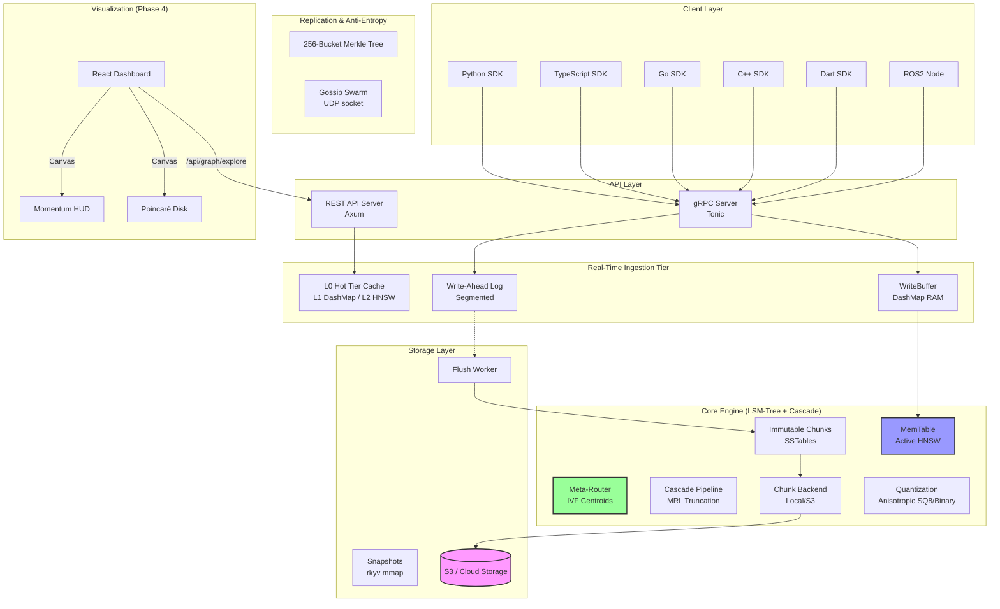
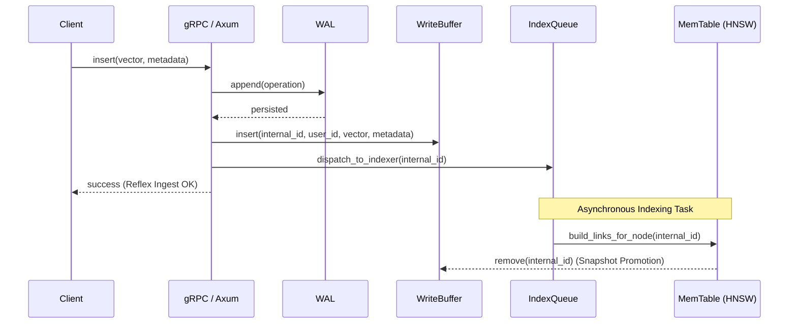
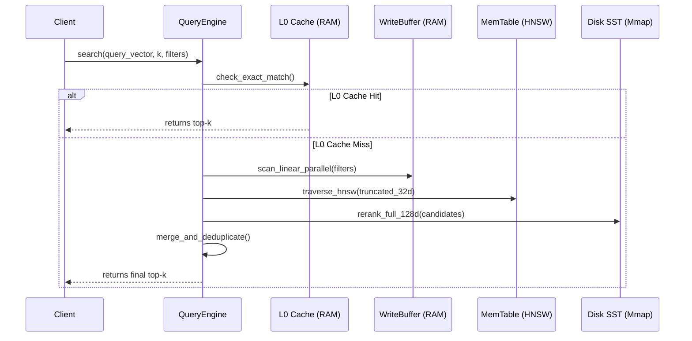
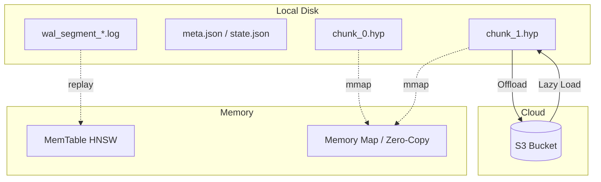
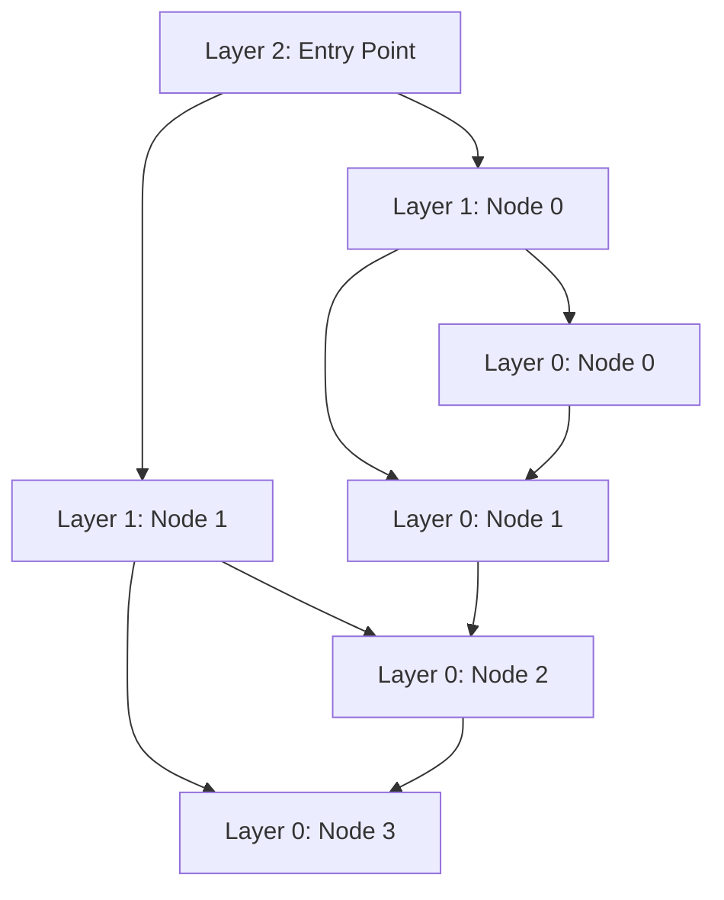
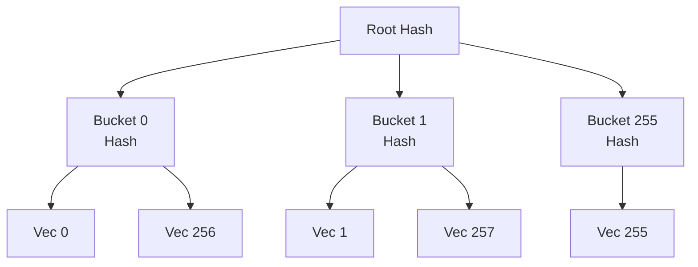
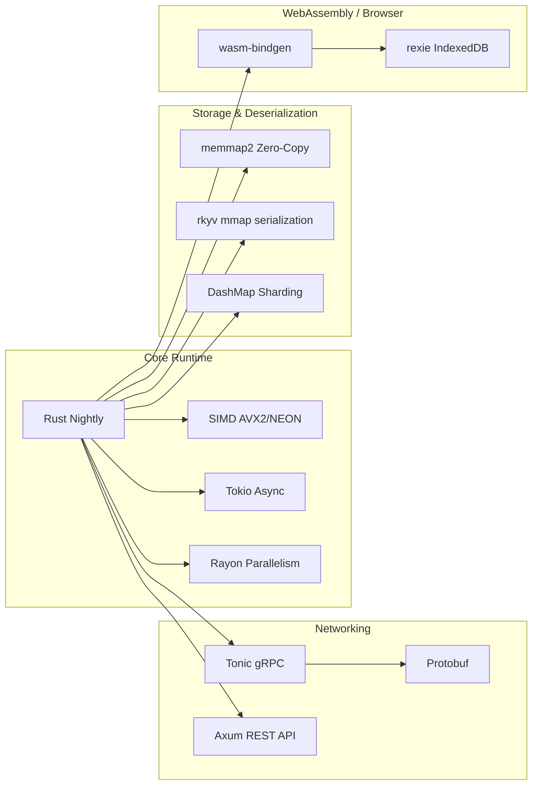

# HyperspaceDB Architecture Guide

HyperspaceDB is a specialized, high-performance spatial AI and vector database designed for high-throughput hyperbolic and Euclidean embedding search. This document details its internal architecture, command-query separation, storage engine, real-time caching, WriteBuffer protocols, and federated synchronization algorithms.

---

## 🏗 System Overview

The system strictly follows a **Command-Query Separation (CQS)** pattern, optimized for write-heavy continuous ingestion and low-latency search workflows.



### Data Flow: Ingestion & WriteBuffer Path



### Data Flow: Schema-Driven Cascade Search (MRL)



---

## 🌌 Cosmological Architecture (The Design Philosophy)

HyperspaceDB relies on principles from modern cosmology to execute vector search dynamically. The database maps semantic dispersion to real physical properties:

1. **Multi-Geometric Routing (The Hubble Tension):**
   Upper layers of the HNSW graph utilize the **Klein projective model**, routing queries via cheap Euclidean chord distances (SIMD-optimized), while the bottom exact-search layer converts metrics back to the **Lorentz hyperboloid** for maximum-precision ranking.
2. **Anisotropic Quantization (The Axis of Evil):**
   Semantic vectors are concentrated along principal components (not cleanly isotropic). Our engine applies a weighted Vector Quantization function ($L \approx ||x||^2 ||e_{||}||^2 + h(x) ||e_{\perp}||^2$) to penalize unaligned orthogonal semantic shifts.
3. **Zonal Quantization (The MOND Hypothesis):**
   At the core of the hyperbolic disk, nodes correspond to broad semantic clusters requiring fewer bits of precision (`i8`/`f16`). Nearing the Euclidean horizon ($||x|| \to 1$), exact relationships demand extreme mapping in pure `f64`.
4. **Density Pruning (The $S_8$ Void Tension):**
   Akin to cosmic voids and clustered galaxies, HyperspaceDB performs Density-based Graph Pruning. Outlying vectors inherit restricted edge mappings, reducing RAM.
5. **Memory Reconsolidation (AI Sleep Mode):**
   Continuous Riemannian SGD pulls vectors towards an attractor state (e.g. Flow Matching) directly via `TriggerReconsolidation`, restructuring the graph dynamically without full re-indexing.
6. **Relativistic Traversal (Dirac & Momentum):**
   Implicit edges in the graph are navigated using **Momentum Traversal**. Instead of greedy steps, the engine uses **Koopman Extrapolations** (SDK) to predict the next node in the semantic trajectory, simulating inertia in the latent space.
7. **Cross-Feature Matching (Wasserstein-1):**
   Instead of $O(N^3)$ generic OT, we execute an ultra-fast $O(N)$ 1D L1-CDF algorithm to compare distributions along feature axes directly inside the metric dispatch.
8. **Cascading Funnel (The MRL Horizon):**
   To avoid the "Curse of Dimensionality" in RAM, HyperspaceDB uses **Matryoshka Representation Learning (MRL)**. The engine defines a **Cascade Pipeline** in the schema: a truncated "head" (e.g. 64D) is indexed in RAM for microsecond retrieval, while the "tail" (e.g. 1536D) is stored on disk for a final precision-rerank phase.

---

## 💾 Storage Layer (LSM-Tree Architecture)

HyperspaceDB uses an **LSM-Tree** inspired architecture for vector search, optimized for high throughput, cloud tiering, and multi-vector schemas.



### 1. MemTable & WAL v3
New vectors are first appended to the **Write-Ahead Log (WAL)** and simultaneously indexed in an in-memory **HNSW MemTable**.
* **WAL Format**: `[Magic: u8][Length: u32][CRC32: u32][OpCode: u8][Data...]`.
* **Rotation**: Once the WAL reaches `HS_WAL_SEGMENT_SIZE_MB`, it is rotated (frozen).
* **Flushing**: A background **Flush Worker** converts the frozen segment into a highly optimized, immutable **HNSW Chunk** (`.hyp`).
* **RAM Reclamation**: After the flush completes, the old MemTable is atomically swapped for a fresh one, freeing up significant memory.
* **Durability Modes**:
    1. **Strict**: Calls `fsync` after every write. Max safety.
    2. **Batch**: Calls `fsync` in a background thread every N ms. Good compromise.
    3. **Async**: Relies on OS page cache. Max speed.

### 2. Immutable Chunks (SSTables)
Data is stored in segmented `.hyp` files, each containing a subset of the collection.
* **Quantization**: Vectors are optionally quantized (e.g., `ScalarI8`), reducing size by 8x or more.
* **MMap**: Hot chunks are searched directly via memory-mapping, leveraging the OS page cache.

### 3. S3 Cloud Tiering (hyperspace-tiering)
Cold chunks can be transparently offloaded to **S3-compatible storage**.
* **Local Cache**: A byte-weighted **LRU cache** manages local disk usage (`HS_MAX_LOCAL_CACHE_GB`).
* **Dynamic Fetch**: Chunks not present locally are automatically downloaded on-demand during search.

---

## ⚡️ Real-Time Acceleration: L0 Cache & WriteBuffer

To bypass the classic bottleneck of HNSW databases (where bulk-inserted vectors remain isolated until fully indexed in the background), HyperspaceDB implements a transparent, dual-layered memory tier.

```
       Incoming Ingestion / Search Request
                     │
          ┌──────────┴──────────┐
          ▼                     ▼
   [WriteBuffer]         [L0 Hot Tier Cache]
   - In-memory DashMap   - L1: DashMap (~1 µs lookups)
   - Rayon-parallel      - L2: Fallback ANN HNSW (~100 µs)
     linear scanning     - Automatic TTL Eviction
   - Snapshot Promotion  - Auto-rebuild (>30% tombstones)
```

### 1. L0 Hot Tier Cache (`hyperspace-cache`)
The L0 Cache resides directly on the client read-path to bypass both HNSW graph traversal and disk reads.
* **L1 Tier (Exact Lookup)**: A 64-shard `DashMap` storing `Arc<Vec<f64>>` + `Arc<HashMap>` data indexed by ID. Lookups complete in **~1 µs**.
* **L2 Tier (ANN Search Fallback)**: Utilizes a high-performance in-memory fallback HNSW graph (`instant-distance`) utilizing `ArcSwap` for lock-free reads during background rebuilds. Lookups complete in **~100 µs**.
* **TTL (Time-To-Live)**: Evaluates the `__ttl` key in vector metadata every 100 ms. Expired records are invalidated from L1 and flagged as tombstones in L2.
* **Self-Healing Rebuilds**: To prevent performance decay from deleted records, a background task automatically rebuilds the L2 ANN graph when the tombstone ratio exceeds **30%**, with a **5-second cooldown** guarding against write storms.
* **Warmup Integration**: When opening collections, a background worker scans `metadata.forward` to preload active keys and de-quantized vectors into the L1 and L2 cache, ensuring high cache hit rates from startup.

### 2. WriteBuffer & Real-time Search Ingestion
The WriteBuffer guarantees that vectors are searchable from the millisecond they are inserted.
* **Buffer Mechanism**: Inserts write to a thread-safe `DashMap` before queuing for background graph linkage.
* **Rayon-Parallel Scanning**: Searches perform a multi-threaded linear scan over the WriteBuffer utilizing AVX2/NEON instructions, evaluating Euclidean or Hyperbolic distances alongside box, cone, or spherical filters.
* **Snapshot Promotion**: Once the background indexing thread completes linking a node into the main HNSW graph, it is removed from the `WriteBuffer`, preventing memory bloat.

---

## 🕸 Indexing Layer (hyperspace-index)

### Metric Abstraction & HNSW
We use a Generic Metric system (`Metric<N>`) to support multiple geometries efficiently, dispatched at compile-time via Const Generics.



#### Core Metric Formulations
1. **Hyperbolic Space (Poincaré Ball)**
   * **Formula**: $ d(u, v) = \text{acosh}\left(1 + 2 \frac{||u-v||^2}{(1-||u||^2)(1-||v||^2)}\right) $
   * **Optimization**: Employs pre-computed scaling factors $\alpha = 1 - ||u||^2$ and bypasses expensive hyperbolic functions during graph routing.
   * **Constraint**: Vectors strictly satisfy $||u|| < 1$.

2. **Euclidean Space (Squared L2)**
   * **Formula**: $ d(u, v) = \sum (u_i - v_i)^2 $
   * **Optimization**: Squared L2 distance to avoid square root calls.

3. **Wasserstein-1 (Cross-Feature Matching)**
   * **Formula**: $ d(u, v) = \sum |CDF_u(i) - CDF_v(i)| $
   * **Optimization**: O(N) evaluation instead of $O(N^3)$ optimal transport solvers.

4. **Hybrid Metric (Fused Lorentz + L2)**
   * **Logic**: Linear combination of hyperbolic and Euclidean distance metrics per request.

---

## 🔁 Replication & Consistency (Anti-Entropy)

HyperspaceDB implements a hybrid replication model supporting both high-availability Cloud deployments and dynamic Edge swarms.

### 1. Leader-Follower replication (Cloud)
* **Replication Log**: Leader captures writes, incrementing Lamport clocks, and broadcasts them via gRPC streams.
* **WAL-based Catch-up**: Followers requesting replication send their `last_logical_clock`. The Leader replays WAL segments incrementally from that clock position.

### 2. Edge-to-Edge Gossip Swarm (Robotics / P2P)
Used for decentralized networks without a central coordinator:
* **UDP Heartbeats**: Nodes broadcast a `GossipMessage::Heartbeat` (containing collection hashes and clock state) every 5 seconds over raw `tokio::net::UdpSocket`.
* **Zero-Dependency**: No heavy DHT or libp2p layers; topology is self-healing using `PEER_TTL` timeouts.
* **Merkle Delta Sync**: Discovering nodes exchange 256-bucket rolling XOR hashes (vector ID % 256). Only diverging buckets are synchronized.



---

## 🧹 Memory Management & Stability

### Cold Storage & Lazy Loading
1. **Lazy Loading**: Collections do not consume memory on startup; only collection metadata schemas are read. Active HNSW structures load on-demand during the first search/get operation.
2. **Idle Eviction (Reaper)**: A background monitor tracks collection access times. Collections inactive for over 1 hour are automatically serialized to disk and pruned from memory.
3. **Graceful Shutdown**: Core `Collection` drop implementations ensure that active background indexing loops, UDP gossip heartbeats, and snapshot threads are immediately cancelled to prevent memory leaks and thread panics.
4. **Jemalloc Tuning**: Integrated with aggressive OS dirty-page decay models (`dirty_decay_ms:0`) to guarantee memory reclamation post-vacuuming.

---

## 🏙 Multi-Tenancy

* **Logical Isolation**: Collection namespaces are physically separated by `user_id` prefixes: `{user_id}_{collection_name}`.
* **API Protection**: Authenticated requests must carry the `x-hyperspace-user-id` header, which restricts execution scope entirely to the tenant's namespace.
* **Accounting Engine**: Per-tenant memory footprints and disk allocations (including `mmap` segments) are tracked dynamically to support resource-based billing models.

---

## 🛠 Technology Stack



---

## 📊 Performance Characteristics

| Operation | Latency | Throughput | Notes |
|-----------|---------|------------|-------|
| **L1 Cache Lookup (exact)** | **~1 µs** | 1,000,000+ QPS | Bypasses all locks and IO |
| **L2 Cache Search (ANN)** | **~100 µs** | 200,000+ QPS | Thread-safe, lock-free HNSW fallback |
| **WriteBuffer Insert (WAL + RAM)** | **~6.4 µs** | 156,587 QPS | Immediate persist, async HNSW |
| **WriteBuffer Linear Scan** | **< 2.0 ms** | 50,000 QPS | 50k vectors, multi-threaded Rayon |
| **Search (MRL Cascade)** | **0.85 ms** (p99) | **210,000 QPS** | 64d RAM Head + 1536d Disk Rerank |
| **Search (Hyperbolic)** | **2.47 ms** (p99) | 165,000 QPS | Poincaré 64d + SIMD |
| **Search (Euclidean)** | **16.12 ms** (p99) | 17,800 QPS | Euclidean 1024d |
| **Cold Startup / Lazy Load** | **< 50 ms** | — | Fast mmap file handles |
| **Synchronous Snapshot** | **~500 ms** | — | Synchronous serialization |

---

*Copyright © 2026 YARlabs - Confidential & Proprietary*
