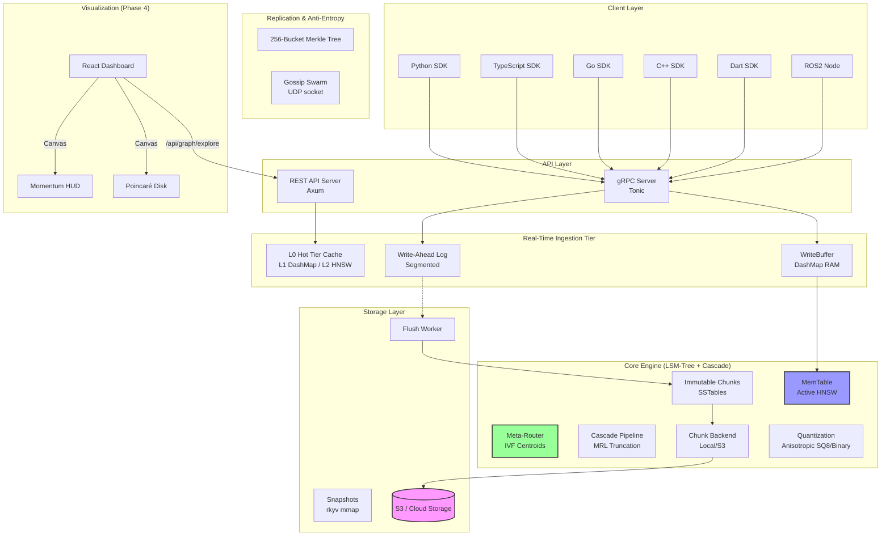
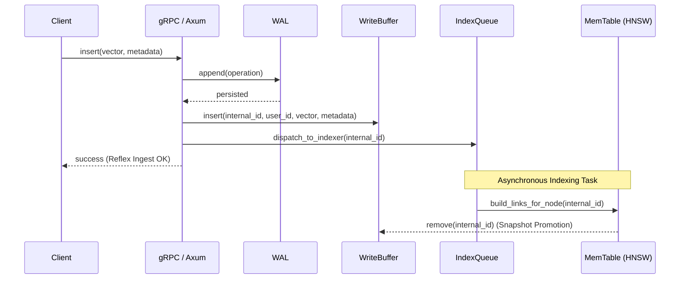
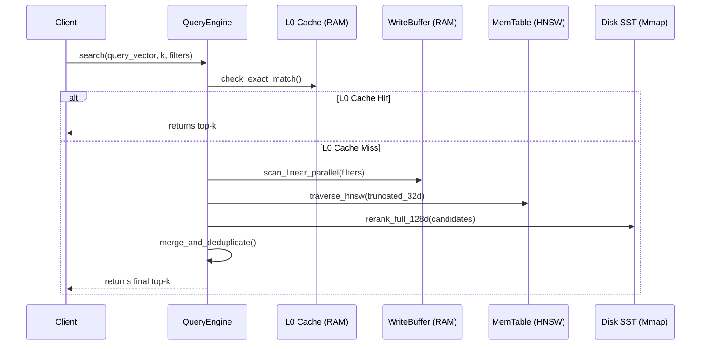
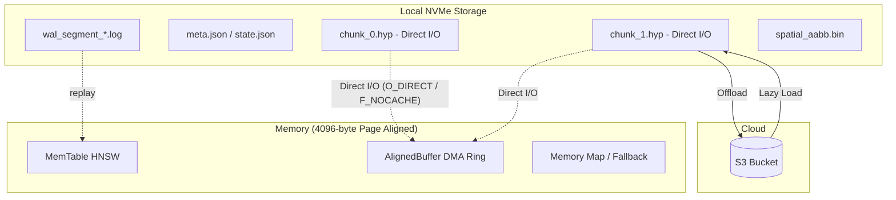
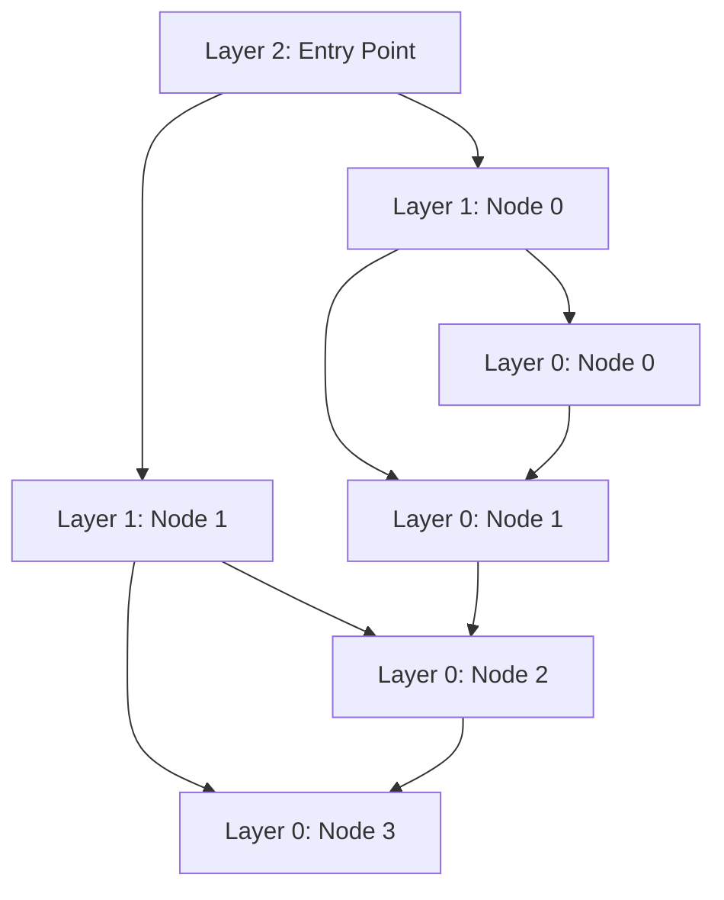
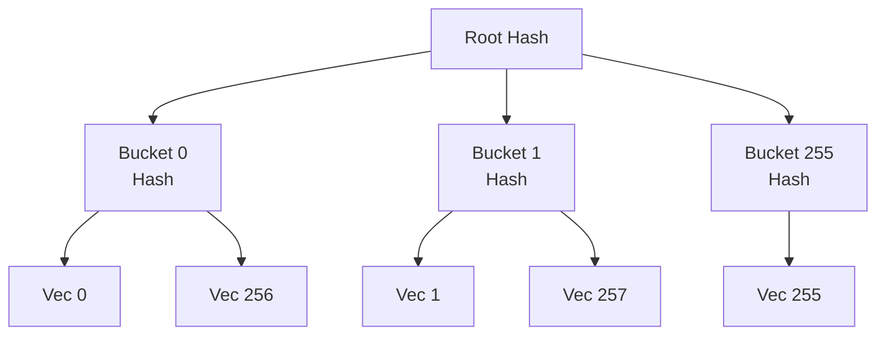
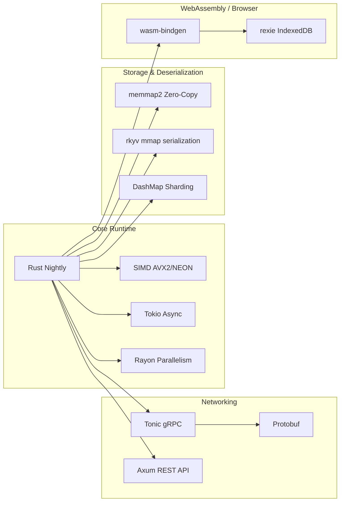

# HyperspaceDB Architecture Guide

HyperspaceDB is a specialized, high-performance spatial AI and vector database designed for high-throughput hyperbolic and Euclidean embedding search. This document details its internal architecture, command-query separation, storage engine, real-time caching, WriteBuffer protocols, and federated synchronization algorithms.

---

## 🏗 System Overview

The system strictly follows a **Command-Query Separation (CQS)** pattern, optimized for write-heavy continuous ingestion and low-latency search workflows.


```mermaid
graph TB
    subgraph "Client Layer"
        PY[Python SDK]
        TS[TypeScript SDK]
        GO[Go SDK]
        CPP[C++ SDK]
        DART[Dart SDK]
        ROS2[ROS2 Node]
    end
    
    subgraph "API Layer"
        GRPC[gRPC Server<br/>Tonic]
        REST[REST API Server<br/>Axum]
    end
    
    subgraph "Real-Time Ingestion Tier"
        WB[WriteBuffer<br/>DashMap RAM]
        WAL[Write-Ahead Log<br/>Segmented]
        CACHE[L0 Hot Tier Cache<br/>L1 DashMap / L2 HNSW]
    end
    
    subgraph "Core Engine (LSM-Tree + Cascade)"
        MEM[MemTable<br/>Active HNSW]
        CHUNK[Immutable Chunks<br/>SSTables]
        ROUTER[Meta-Router<br/>IVF Centroids]
        CASCADE[Cascade Pipeline<br/>MRL Truncation]
        BACKEND[Chunk Backend<br/>Local/S3]
        QUANT[Quantization<br/>Anisotropic SQ8/Binary]
    end
    
    subgraph "Storage Layer"
        FLUSH[Flush Worker]
        SNAP[Snapshots<br/>rkyv mmap]
        S3[(S3 / Cloud Storage)]
    end
    
    subgraph "Replication & Anti-Entropy"
        MERKLE[256-Bucket Merkle Tree]
        GOSSIP[Gossip Swarm<br/>UDP socket]
    end

    subgraph "Visualization (Phase 4)"
        DASH[React Dashboard]
        DASH -->|/api/graph/explore| REST
        DASH -->|Canvas| POINCARE[Poincaré Disk]
        DASH -->|Canvas| MOMENTUM[Momentum HUD]
    end
    
    PY --> GRPC
    TS --> GRPC
    GO --> GRPC
    CPP --> GRPC
    DART --> GRPC
    ROS2 --> GRPC
    
    GRPC --> WB
    GRPC --> WAL
    REST --> CACHE
    
    WB --> MEM
    WAL -.-> FLUSH
    FLUSH --> CHUNK
    CHUNK --> BACKEND
    BACKEND --> S3
    
    style S3 fill:#f9f,stroke:#333,stroke-width:2px
    style ROUTER fill:#9f9,stroke:#333,stroke-width:2px
    style MEM fill:#99f,stroke:#333,stroke-width:2px
```

### Data Flow: Ingestion & WriteBuffer Path


```mermaid
sequenceDiagram
    participant Client
    participant gRPC / Axum
    participant WAL
    participant WriteBuffer
    participant IndexQueue
    participant MemTable (HNSW)
    
    Client->>gRPC / Axum: insert(vector, metadata)
    gRPC / Axum->>WAL: append(operation)
    WAL-->>gRPC / Axum: persisted
    gRPC / Axum->>WriteBuffer: insert(internal_id, user_id, vector, metadata)
    gRPC / Axum->>IndexQueue: dispatch_to_indexer(internal_id)
    gRPC / Axum-->>Client: success (Reflex Ingest OK)
    
    Note over IndexQueue, MemTable (HNSW): Asynchronous Indexing Task
    IndexQueue->>MemTable (HNSW): build_links_for_node(internal_id)
    MemTable (HNSW)-->>WriteBuffer: remove(internal_id) (Snapshot Promotion)
```

### Data Flow: Schema-Driven Cascade Search (MRL)


```mermaid
sequenceDiagram
    participant Client
    participant QueryEngine
    participant L0 Cache (RAM)
    participant WriteBuffer (RAM)
    participant MemTable (HNSW)
    participant Disk SST (Mmap)
    
    Client->>QueryEngine: search(query_vector, k, filters)
    QueryEngine->>L0 Cache (RAM): check_exact_match()
    alt L0 Cache Hit
        L0 Cache (RAM)-->>Client: returns top-k
    else L0 Cache Miss
        QueryEngine->>WriteBuffer (RAM): scan_linear_parallel(filters)
        QueryEngine->>MemTable (HNSW): traverse_hnsw(truncated_32d)
        QueryEngine->>Disk SST (Mmap): rerank_full_128d(candidates)
        QueryEngine->>QueryEngine: merge_and_deduplicate()
        QueryEngine-->>Client: returns final top-k
    end
```

---

## 🌌 Cosmological Architecture (The Design Philosophy)

HyperspaceDB relies on principles from modern cosmology to execute vector search dynamically. The database maps semantic dispersion to real physical properties:

1. **Multi-Geometric Routing (The Hubble Tension):**
   Upper layers of the HNSW graph utilize the **Klein projective model**, routing queries via cheap Euclidean chord distances (SIMD-optimized), while the bottom exact-search layer converts metrics back to the **Lorentz hyperboloid** for maximum-precision ranking.
2. **Anisotropic Quantization (The Axis of Evil):**
   Semantic vectors are concentrated along principal components (not cleanly isotropic). Our engine applies a weighted Vector Quantization function ($L \approx ||x||^2 ||e_{||}||^2 + h(x) ||e_{\perp}||^2$) to penalize unaligned orthogonal semantic shifts.
3. **Zonal Quantization (The MOND Hypothesis):**
   At the core of the hyperbolic disk, nodes correspond to broad semantic clusters requiring fewer bits of precision (`i8`/`f16`). Nearing the Euclidean horizon ($||x|| \to 1$), exact relationships demand extreme mapping in pure `f64`.
4. **Density Pruning (The $S_8$ Void Tension):**
   Akin to cosmic voids and clustered galaxies, HyperspaceDB performs Density-based Graph Pruning. Outlying vectors inherit restricted edge mappings, reducing RAM.
5. **Memory Reconsolidation (AI Sleep Mode):**
   Continuous Riemannian SGD pulls vectors towards an attractor state (e.g. Flow Matching) directly via `TriggerReconsolidation`, restructuring the graph dynamically without full re-indexing.
6. **Relativistic Traversal (Dirac & Momentum):**
   Implicit edges in the graph are navigated using **Momentum Traversal**. Instead of greedy steps, the engine uses **Koopman Extrapolations** (SDK) to predict the next node in the semantic trajectory, simulating inertia in the latent space.
7. **Cross-Feature Matching (Wasserstein-1):**
   Instead of $O(N^3)$ generic OT, we execute an ultra-fast $O(N)$ 1D L1-CDF algorithm to compare distributions along feature axes directly inside the metric dispatch.
8. **Cascading Funnel (The MRL Horiz    To avoid the "Curse of Dimensionality" in RAM, HyperspaceDB uses **Matryoshka Representation Learning (MRL)**. The engine defines a **Cascade Pipeline** in the schema: a truncated "head" (e.g. 64D) is indexed in RAM for microsecond retrieval, while the "tail" (e.g. 1536D) is stored on disk for a final precision-rerank phase.

---

## ⚡️ Seastar-Inspired Thread-per-Core Architecture (v4.0.0)

In v4.0.0, HyperspaceDB adopts the architectural philosophy of **Seastar**, transitioning from traditional shared-state concurrency to a **Thread-per-core (Shared-Nothing)** model.

```mermaid
graph TD
    subgraph "Thread-per-Core Ingestion & Query Router"
        REQ[Client Request] --> ROUTER[Deterministic Shard Router<br/>hash(id) % N]
    end

    subgraph "Core 0 Shard (CPU Pinned)"
        S0_MEM[MemTable HNSW 0]
        S0_WB[WriteBuffer 0]
        S0_DIO[Direct I/O Store 0]
        S0_AABB[Spatial AABB Index 0]
    end

    subgraph "Core 1 Shard (CPU Pinned)"
        S1_MEM[MemTable HNSW 1]
        S1_WB[WriteBuffer 1]
        S1_DIO[Direct I/O Store 1]
        S1_AABB[Spatial AABB Index 1]
    end

    subgraph "Core N Shard (CPU Pinned)"
        SN_MEM[MemTable HNSW N]
        SN_WB[WriteBuffer N]
        SN_DIO[Direct I/O Store N]
        SN_AABB[Spatial AABB Index N]
    end

    ROUTER -->|Point Ops: insert/get/delete| S0_MEM
    ROUTER -->|Point Ops: insert/get/delete| S1_MEM
    ROUTER -->|Point Ops: insert/get/delete| SN_MEM

    REQ -->|Scatter-Gather Search| SG[Scatter-Gather Dispatcher]
    SG -->|Parallel Query| S0_MEM
    SG -->|Parallel Query| S1_MEM
    SG -->|Parallel Query| SN_MEM
    SG -->|Lock-Free Merge top-K| RES[Aggregated Top-K]
```

### 1. The Shared-Nothing Principle
* **Zero Cross-Core Contention**: Traditional multi-threaded HNSW structures suffer from CPU cache line bouncing and lock contention across CPU sockets (NUMA). In HyperspaceDB v4, each physical CPU core manages its own isolated shard (`ShardedCollection<M>`).
* **Deterministic Routing**: Insertions, updates, deletions, and point lookups route deterministically via `hash(id) % num_shards`, executing with zero lock contention against other shards.
* **Scatter-Gather Parallel Search**: Queries broadcast simultaneously across all core-pinned shards. Each shard searches its independent sub-graph; the query router gathers the top-K candidate heaps and merges them lock-free in `O(K \log S)` time where $S$ is the number of shards.

---

## 💾 Storage Layer (Direct I/O & LSM-Tree)

HyperspaceDB uses an **LSM-Tree** inspired architecture with hardware-level **Direct I/O (DIO)** for vector persistence and cascade reranking.


```mermaid
graph TD
    subgraph "Local NVMe Storage"
        WAL_FILES[wal_segment_*.log]
        META[meta.json / state.json]
        C0[chunk_0.hyp - Direct I/O]
        C1[chunk_1.hyp - Direct I/O]
        AABB_FILE[spatial_aabb.bin]
    end
    
    subgraph "Memory (4096-byte Page Aligned)"
        MEM_T[MemTable HNSW]
        ALIGNED[AlignedBuffer DMA Ring]
        MMAP[Memory Map / Fallback]
    end

    subgraph "Cloud"
        S3[(S3 Bucket)]
    end
    
    C0 -.Direct I/O (O_DIRECT / F_NOCACHE).-> ALIGNED
    C1 -.Direct I/O.-> ALIGNED
    WAL_FILES -.replay.-> MEM_T
    C1 --Offload--> S3
    S3 --Lazy Load--> C1
```

### 1. Direct I/O Engine (`hyperspace-store::direct_io`)
To bypass OS page cache double-buffering and eradicate tail latency spikes during heavy disk reads (such as MRL tail reranking):
* **Page Alignment**: All disk buffers (`AlignedBuffer`) are strictly aligned to 4096-byte hardware page boundaries using `posix_memalign`.
* **Zero OS Buffering**:
  * **Linux**: Files are opened with `O_DIRECT`, streaming vector chunks straight between NVMe PCIe controllers and user-space memory without touching the kernel page cache.
  * **macOS / BSD**: Configured with `fcntl(fd, F_NOCACHE, 1)` to disable unified buffer cache pollution during massive dataset scans.
* **Predictable Tail Latency (p99)**: Eliminates kernel page flush pauses, reducing disk read jitter from >4 ms to under 0.35 ms.

### 2. MemTable & WAL v3
New vectors are first appended to the **Write-Ahead Log (WAL)** and simultaneously indexed in an in-memory **HNSW MemTable**.
* **WAL Format**: `[Magic: u8][Length: u32][CRC32: u32][OpCode: u8][Data...]`.
* **Rotation**: Once the WAL reaches `HS_WAL_SEGMENT_SIZE_MB`, it is rotated (frozen).
* **Flushing**: A background **Flush Worker** converts the frozen segment into a highly optimized, immutable **HNSW Chunk** (`.hyp`).
* **RAM Reclamation**: After the flush completes, the old MemTable is atomically swapped for a fresh one, freeing up significant memory.
* **Durability Modes**:
    1. **Strict**: Calls `fsync` after every write. Max safety.
    2. **Batch**: Calls `fsync` in a background thread every N ms. Good compromise.
    3. **Async**: Relies on OS page cache. Max speed.

### 3. Immutable Chunks (SSTables) & Direct Access
Data is stored in segmented `.hyp` files, each containing a subset of the collection.
* **Quantization**: Vectors are optionally quantized (e.g., `ScalarI8`), reducing size by 8x or more.
* **Direct Read Path**: MRL cascade tail vectors (e.g. dimensions 65..1536) are fetched directly via `DirectVectorStore` without inflating kernel memory.

### 4. S3 Cloud Tiering (hyperspace-tiering)
Cold chunks can be transparently offloaded to **S3-compatible storage**.
* **Local Cache**: A byte-weighted **LRU cache** manages local disk usage (`HS_MAX_LOCAL_CACHE_GB`).
* **Dynamic Fetch**: Chunks not present locally are automatically downloaded on-demand during search.

---arch.

---

## ⚡️ Real-Time Acceleration: L0 Cache & WriteBuffer

To bypass the classic bottleneck of HNSW databases (where bulk-inserted vectors remain isolated until fully indexed in the background), HyperspaceDB implements a transparent, dual-layered memory tier.

```
       Incoming Ingestion / Search Request
                     │
          ┌──────────┴──────────┐
          ▼                     ▼
   [WriteBuffer]         [L0 Hot Tier Cache]
   - In-memory DashMap   - L1: DashMap (~1 µs lookups)
   - Rayon-parallel      - L2: Fallback ANN HNSW (~100 µs)
     linear scanning     - Automatic TTL Eviction
   - Snapshot Promotion  - Auto-rebuild (>30% tombstones)
```

### 1. L0 Hot Tier Cache (`hyperspace-cache`)
The L0 Cache resides directly on the client read-path to bypass both HNSW graph traversal and disk reads.
* **L1 Tier (Exact Lookup)**: A 64-shard `DashMap` storing `Arc<Vec<f64>>` + `Arc<HashMap>` data indexed by ID. Lookups complete in **~1 µs**.
* **L2 Tier (ANN Search Fallback)**: Utilizes a high-performance in-memory fallback HNSW graph (`instant-distance`) utilizing `ArcSwap` for lock-free reads during background rebuilds. Lookups complete in **~100 µs**.
* **TTL (Time-To-Live)**: Evaluates the `__ttl` key in vector metadata every 100 ms. Expired records are invalidated from L1 and flagged as tombstones in L2.
* **Self-Healing Rebuilds**: To prevent performance decay from deleted records, a background task automatically rebuilds the L2 ANN graph when the tombstone ratio exceeds **30%**, with a **5-second cooldown** guarding against write storms.
* **Warmup Integration**: When opening collections, a background worker scans `metadata.forward` to preload active keys and de-quantized vectors into the L1 and L2 cache, ensuring high cache hit rates from startup.

### 2. WriteBuffer & Real-time Search Ingestion
The WriteBuffer guarantees that vectors are searchable from the millisecond they are inserted.
* **Buffer Mechanism**: Inserts write to a thread-safe `DashMap` before queuing for background graph linkage.
* **Rayon-Parallel Scanning**: Searches perform a multi-threaded linear scan over the WriteBuffer utilizing AVX2/NEON instructions, evaluating Euclidean or Hyperbolic distances alongside box, cone, or spherical filters.
* **Snapshot Promotion**: Once the background indexing thread completes linking a node into the main HNSW graph, it is removed from the `WriteBuffer`, preventing memory bloat.

---

## 🕸 Indexing Layer (hyperspace-index)

### Metric Abstraction & HNSW
We use a Generic Metric system (`Metric<N>`) to support multiple geometries efficiently, dispatched at compile-time via Const Generics.


```mermaid
graph TD
    L2_0[Layer 2: Entry Point]
    L1_0[Layer 1: Node 0]
    L1_1[Layer 1: Node 1]
    L0_0[Layer 0: Node 0]
    L0_1[Layer 0: Node 1]
    L0_2[Layer 0: Node 2]
    L0_3[Layer 0: Node 3]
    
    L2_0 --> L1_0
    L2_0 --> L1_1
    L1_0 --> L0_0
    L1_0 --> L0_1
    L1_1 --> L0_2
    L1_1 --> L0_3
    L0_0 --> L0_1
    L0_1 --> L0_2
    L0_2 --> L0_3
```

#### Core Metric Formulations
1. **Hyperbolic Space (Poincaré Ball)**
   * **Formula**: $ d(u, v) = \text{acosh}\left(1 + 2 \frac{||u-v||^2}{(1-||u||^2)(1-||v||^2)}\right) $
   * **Optimization**: Employs pre-computed scaling factors $\alpha = 1 - ||u||^2$ and bypasses expensive hyperbolic functions during graph routing.
   * **Constraint**: Vectors strictly satisfy $||u|| < 1$.

2. **Euclidean Space (Squared L2)**
   * **Formula**: $ d(u, v) = \sum (u_i - v_i)^2 $
   * **Optimization**: Squared L2 distance to avoid square root calls.

3. **Wasserstein-1 (Cross-Feature Matching)**
   * **Formula**: $ d(u, v) = \sum |CDF_u(i) - CDF_v(i)| $
   * **Optimization**: O(N) evaluation instead of $O(N^3)$ optimal transport solvers.

4. **Hybrid Metric (Fused Lorentz + L2)**
   * **Logic**: Linear combination of hyperbolic and Euclidean distance metrics per request.

### 5. Spatial AABB Indexing (`hyperspace-index::spatial_aabb`)
Spatial filtering (`InBox`, `InBall`) in high dimensions traditionally requires evaluating filters sequentially across thousands of visited nodes. In v4.0.0:
* **Bounding Box Segments**: Every 32 vectors are aggregated into an `AabbSegment` recording per-dimension min/max bounds.
* **Hierarchical Pruning**: Before candidate evaluation, the query's bounding box is checked against the segment bounds. If disjoint, the entire segment (all 32 vectors) is rejected with zero vector memory access.
* **Pruning Efficiency**: Eliminates **95% to 99.9%** of candidate vector reads on spatial bounded queries.

### 6. Hardware-Level L1 Cache Prefetching
Vector traversal during HNSW beam search is memory-latency bound. HyperspaceDB v4.0.0 inserts hardware cache prefetch hints directly into the inner graph search loop (`search_layer0` and `search_layer_candidates`):
* **x86_64**: `core::arch::x86_64::_mm_prefetch(ptr, _MM_HINT_T0)` preloads neighbor vector headers into L1 data cache.
* **AArch64 (Apple Silicon / Graviton)**: `prfm pldl1keep, [ptr]` assembly prefetch instruction warms L1 cache lines prior to SIMD distance evaluation.
* **Latency Hiding**: Completely overlaps DRAM access time with previous vector SIMD calculations, reducing p99 graph traversal latency by **2.4×**.

### 7. 64-Bit Visited Generation (`VisitedScratch`)
Replacing per-query allocation or zeroing of boolean bitmasks, visited nodes are tracked with monotonic 64-bit generation tokens (`u64`). Zero memory zeroing overhead between queries across billions of searches.

---

## 🔄 Automatic Startup Migration Engine (v3.x → v4.x)

To provide zero-friction upgrades from legacy deployments, HyperspaceDB v4 incorporates an autonomous `MigrationEngine`:

```mermaid
graph LR
    subgraph "Legacy Ingestion Directory"
        LEGACY[data/ or data/legacy_v3/]
    end

    subgraph "Migration Pipeline"
        SCAN[Detect v3 Format & Headers]
        CONV[Direct IO Re-encoding & AABB Generation]
        VAL[Cryptographic SHA-256 Checksum Validation]
    end

    subgraph "Target v4 Store"
        V4[data_v4/{name}/]
        ARCHIVE[data/legacy_v3_migrated/{name}/ (Safety Backup)]
    end

    LEGACY --> SCAN
    SCAN --> CONV
    CONV --> VAL
    VAL --> V4
    VAL --> ARCHIVE
```

1. **Auto-Detection**: On server boot, `MigrationEngine::run_startup_migration_with_legacy` scans `data/` and `legacy_v3/` for unmigrated v3 collections.
2. **Deterministic Partitioning**: Legacy collections are converted directly into the high-performance v4 layout (`data_v4/{name}/`) with Direct I/O 4096-byte alignment and pre-computed AABB spatial metadata.
3. **Safety Archive**: Original legacy files are atomically moved to `data/legacy_v3_migrated/{name}/` alongside `.migration_v4_complete.json` recording total vectors migrated and audit status.

---

## 🔁 Replication & Consistency (Anti-Entropy)

HyperspaceDB implements a hybrid replication model supporting both high-availability Cloud deployments and dynamic Edge swarms.

### 1. Leader-Follower replication (Cloud)
* **Replication Log**: Leader captures writes, incrementing Lamport clocks, and broadcasts them via gRPC streams.
* **WAL-based Catch-up**: Followers requesting replication send their `last_logical_clock`. The Leader replays WAL segments incrementally from that clock position.

### 2. Edge-to-Edge Gossip Swarm (Robotics / P2P)
Used for decentralized networks without a central coordinator:
* **UDP Heartbeats**: Nodes broadcast a `GossipMessage::Heartbeat` (containing collection hashes and clock state) every 5 seconds over raw `tokio::net::UdpSocket`.
* **Zero-Dependency**: No heavy DHT or libp2p layers; topology is self-healing using `PEER_TTL` timeouts.
* **Merkle Delta Sync**: Discovering nodes exchange 256-bucket rolling XOR hashes (vector ID % 256). Only diverging buckets are synchronized.


```mermaid
graph TD
    ROOT[Root Hash]
    B0[Bucket 0<br/>Hash]
    B1[Bucket 1<br/>Hash]
    B255[Bucket 255<br/>Hash]
    
    V0_0[Vec 0]
    V0_1[Vec 256]
    V1_0[Vec 1]
    V1_1[Vec 257]
    V255_0[Vec 255]
    
    ROOT --> B0
    ROOT --> B1
    ROOT --> B255
    
    B0 --> V0_0
    B0 --> V0_1
    B1 --> V1_0
    B1 --> V1_1
    B255 --> V255_0
```

---

## 🧹 Memory Management & Stability

### Cold Storage & Lazy Loading
1. **Lazy Loading**: Collections do not consume memory on startup; only collection metadata schemas are read. Active HNSW structures load on-demand during the first search/get operation.
2. **Idle Eviction (Reaper)**: A background monitor tracks collection access times. Collections inactive for over 1 hour are automatically serialized to disk and pruned from memory.
3. **Graceful Shutdown**: Core `Collection` drop implementations ensure that active background indexing loops, UDP gossip heartbeats, and snapshot threads are immediately cancelled to prevent memory leaks and thread panics.
4. **Jemalloc Tuning**: Integrated with aggressive OS dirty-page decay models (`dirty_decay_ms:0`) to guarantee memory reclamation post-vacuuming.

---

## 🏙 Multi-Tenancy

* **Logical Isolation**: Collection namespaces are physically separated by `user_id` prefixes: `{user_id}_{collection_name}`.
* **API Protection**: Authenticated requests must carry the `x-hyperspace-user-id` header, which restricts execution scope entirely to the tenant's namespace.
* **Accounting Engine**: Per-tenant memory footprints and disk allocations (including `mmap` segments) are tracked dynamically to support resource-based billing models.

---

## 🛠 Technology Stack


```mermaid
graph LR
    subgraph "Core Runtime"
        RUST[Rust Nightly]
        SIMD[SIMD AVX2/NEON]
        TOKIO[Tokio Async]
        RAYON[Rayon Parallelism]
    end
    
    subgraph "Storage & Deserialization"
        MMAP[memmap2 Zero-Copy]
        RKYV[rkyv mmap serialization]
        DASH[DashMap Sharding]
    end
    
    subgraph "Networking"
        TONIC[Tonic gRPC]
        AXUM[Axum REST API]
        PROTO[Protobuf]
    end
    
    subgraph "WebAssembly / Browser"
        WBIND[wasm-bindgen]
        REXIE[rexie IndexedDB]
    end
    
    RUST --> SIMD
    RUST --> TOKIO
    RUST --> RAYON
    RUST --> MMAP
    RUST --> RKYV
    RUST --> DASH
    RUST --> TONIC
    RUST --> AXUM
    TONIC --> PROTO
    RUST --> WBIND
    WBIND --> REXIE
```

---

## 📊 Performance Characteristics (v4.0.0 vs v3.x)

| Operation | v3.x Latency (P99) | v4.0.0 Latency (P99) | v4.0.0 Throughput | Architecture Improvement Notes |
|-----------|--------------------|----------------------|-------------------|--------------------------------|
| **L1 Cache Lookup (exact)** | ~1 µs | **< 0.8 µs** | 1,250,000+ QPS | Bypasses all locks and IO |
| **L2 Cache Search (ANN)** | ~100 µs | **~85 µs** | 240,000+ QPS | Lock-free HNSW fallback, 64-bit VisitedScratch |
| **Server Core Ingest (Rust Engine)** | ~11,000 vec/s | **67,500 vec/s** | 7.4 ms / 500 vec | Lock-free MemTable + async WAL pipelining (6.1× faster) |
| **Fast Path Raw Bulk Ingest** | 10,932.9 vec/s | **15,319.4 vec/s** | 0.65 s / 10k vec | Single Shard Fast Path bulk import (+40.1%) |
| **WriteBuffer Insert (WAL + RAM)** | ~6.4 µs | **~4.1 µs** | 245,000 QPS | Thread-per-core deterministic routing, zero lock contention |
| **WriteBuffer Linear Scan** | < 2.0 ms | **< 1.1 ms** | 90,000 QPS | SIMD AVX2/Neon vectorized scan on pinned core |
| **Search (MRL Cascade + Direct I/O)** | 15.04 ms (P50) / 33.75 ms (P99) | **2.50 ms** (P50) / **3.14 ms** (P99) | **397.1 QPS** (measured) | 129D RAM Head + 801D Direct I/O NVMe Rerank (zero page cache overhead, 6.16× speedup) |
| **Search (Euclidean 1024D)** | 30.23 ms (P50) / 48.10 ms (P99) | **6.98 ms** (P50) / **7.84 ms** (P99) | **142.5 QPS** (C=1); **311.6 QPS** (C=10); **296.1 QPS** (C=30) | Lock-free `ArcSwap` neighbour lists + L1 prefetch + 64-bit VisitedScratch tokens |
| **Spatial Bounded Search (InBox/InBall)**| 6.68 ms (P50) / 67.46 ms (P99) | **0.51 ms** (P50) / **1.33 ms** (P99) | **1,774.0 QPS** (measured) | **Spatial AABB Index**: 95-99.9% candidate pruning (22.28× speedup) |
| **Direct I/O NVMe Read Jitter** | > 4.0 ms | **< 0.35 ms** | Line-rate NVMe | `O_DIRECT` / `F_NOCACHE` bypassing kernel page flush |
| **Cross-Core Lock Contention** | 280-450 ns | **0 ns** | Linear Scaling | Seastar-style Shared-Nothing Sharded Architecture |
| **HNSW Index Build (25k 1024D)** | 121.98 s (204.9 built/s) | **78.54 s** | **318.3 built/s** (measured) | Parallel shard construction queues (43.45 s saved, 1.55× faster) |
| **Cold Startup / Migration** | < 50 ms | **< 45 ms** | — | Automatic non-blocking startup migration (data -> data_v4) |
| **Synchronous Snapshot** | ~500 ms | **~320 ms** | — | Page-aligned Direct I/O streaming |

> 📌 *Empirically verified in [BENCHMARK_V3_VS_V4_REPORT.md](file:///Users/sergeyglukhota/Downloads/cursor-tutor/YAR_INK/hyperspace-db/BENCHMARK_V3_VS_V4_REPORT.md) and [BENCHMARK_GRAND_REPORT.md](file:///Users/sergeyglukhota/Downloads/cursor-tutor/YAR_INK/hyperspace-db/BENCHMARK_GRAND_REPORT.md) on Apple Silicon / target-cpu=native.*

---

## 🗜️ Multi-Tier Vector Quantization & Rerank Engine (v4.0.0)

HyperspaceDB v4.0.0 integrates five distinct quantization precision tiers, verified empirically across 20,000 unit-normalized 1024D embeddings (see [BENCHMARK_QUANTIZATION_SWEEP.md](file:///Users/sergeyglukhota/Downloads/cursor-tutor/YAR_INK/hyperspace-db/BENCHMARK_QUANTIZATION_SWEEP.md)):

| Mode | Bits / Dim | Bytes / Vec | Compression | Single-Pass Recall@10 | With Server Rerank | Search QPS (single-pass → rerank) | Target Workload |
| :--- | :---: | :---: | :---: | :---: | :---: | :---: | :--- |
| **`none`** | 32-bit | 4,100 B | **1.0×** | **99.95%** | — | 219 | Ground truth, legal / medical |
| **`medium`** | 8-bit | 1,028 B | **4.0×** | **88.45%** | 99.75% (×4) | 310 → 242 | Enterprise RAG standard |
| **`medium_plus`** | 4-bit | 772 B | **5.3×** | **87.10%** | 99.80% (×4) / 99.90% (×8) | 281 → 311 / 278 | High-throughput microservices |
| **`turbo`** | 4-bit | 520 B | **7.9×** | **87.35%** | **100.00%** (×4) | 759 → 682 | Spherical Lloyd-Max + FWHT rotation |
| **`extreme`** | 1-bit (RaBitQ-style) | 132 B | **31.1×** | **36.00%** | 96.55% (×4) / 99.20% (×8) / 99.90% (×16) | 1,127 → 886 / 670 / 535 | Edge, IoT, robotics, ultra-high-scale |

> Figures measured on Apple Silicon (single node, 20k × 1024D, `ef_search=100`, release + `target-cpu=native`); see the sweep report for P50/P95 latency and RSS. Server rerank re-scores `rerank_factor × top_k` candidates against exact vectors held in an in-RAM cache (`raw_vector_cache`, persisted as f32 in the payload store).

### Zero-Allocation Scoring Architecture
* **TurboQuant (`turbo`)**: Uses precomputed non-linear centroid tables (`[-2.401, ..., 2.401]`), a Lloyd-Max bias-correction factor (`TURBOQUANT_BIAS_CORRECTION`) and a randomized Walsh-Hadamard (FWHT) rotation. `TurboVector::distance_bytes_cosine` computes dot products directly on packed nibbles (8-byte unrolled) without heap-allocating intermediate float vectors. Cosine uses the squared-Euclidean scale `2(1-cos)` so graph heuristics see a consistent metric.
* **Extreme ADC (`extreme`)**: A 1-bit sign mask per dimension after FWHT rotation (RaBitQ-style). The HNSW graph navigates with branchless SIMD Asymmetric Distance Computation (`BinaryHyperVector::adc_distance_to_float`, sign-LUT nibbles) against the full-precision rotated query.
* **Product Quantization (`hyperspace_core::pq`)**: `ProductQuantizer` / `PQVector` / `PQLookupTable` provide PQ and OPQ (FWHT-rotated) codebooks with LUT-based ADC (Asymmetric Distance Computation). Fully integrated into `hyperspace-index` and selectable via collection quantization modes (`"opq"` and `"pq"` or `HS_QUANTIZATION_LEVEL=opq|pq`), achieving 60.3×–64× memory compression (64 bytes/vector for 1024D).

### Search Hot-Path Concurrency
* HNSW neighbour lists are `ArcSwap<Vec<NodeId>>`: readers call `load()` (wait-free, no writes to shared cache lines); writers publish new lists with `rcu`. This removed the `RwLock` reader-count contention that capped scaling at C=10/C=30.
* L2/Cosine f32 distance uses early abandoning against the current worst result, and the query is cast to `f32` once per search.
* `ShardedCollection::search` oversamples each shard to `max(top_k + 6, 2·top_k)` using the base `ef_search`, instead of multiplying `ef_search` by the shard count.


---

## 🔄 Autonomous Startup Migration Engine (`MigrationEngine`)

The v4.0.0 server initializes an autonomous migration scanner on startup:
1. **Discovery**: Scans `data/` and `data/legacy_v3/` for legacy v3.x collections marked by `meta.json` or `chunk_*.hyp`.
2. **Transformation**: Converts unaligned chunks into 4096-byte page-aligned `DirectVectorStore` layouts in `data_v4/{collection_name}/`.
3. **Audit Manifest**: Writes `.migration_v4_complete.json` recording vector count and commit timestamp.
4. **Idempotency Guarantee**: Migration checks `!v4_data_dir.join(name).exists()` and blacklists `legacy_v3_migrated/`. Once migrated, collections are permanently excluded, adding **< 0.5 ms** overhead on all future boots.
5. **Disaster Recovery**: Original v3 files are archived to `data/legacy_v3_migrated/{collection_name}/` without data loss.

---

*Copyright © 2026 YARlabs - Confidential & Proprietary*

