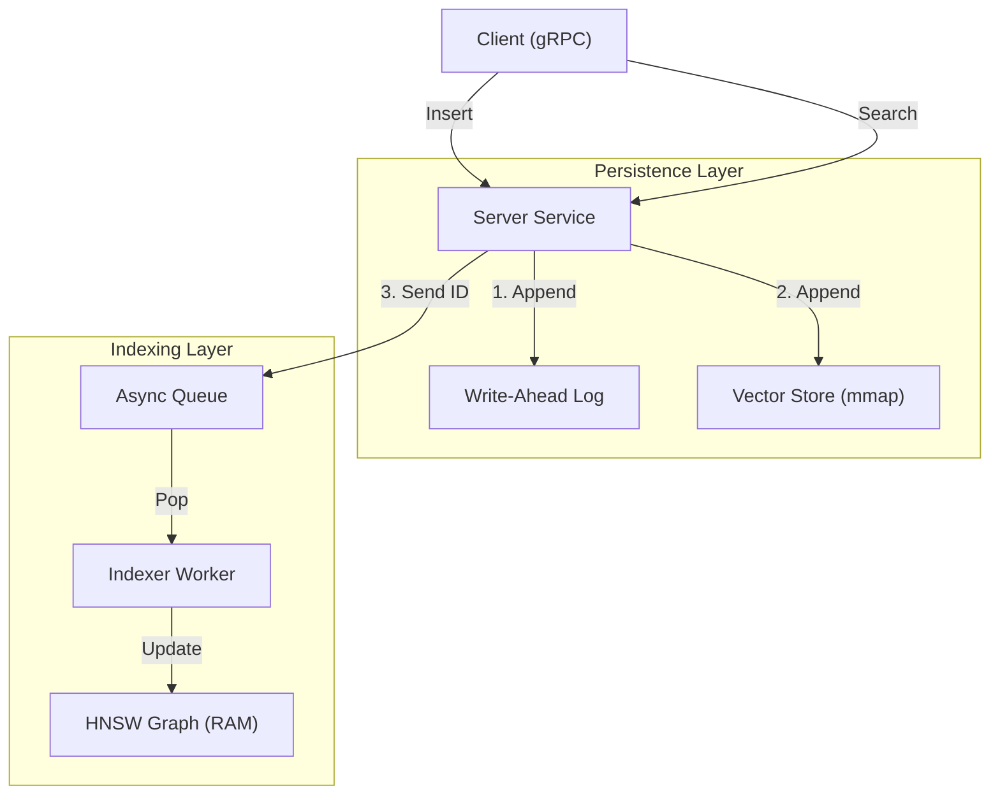

# [H] HyperspaceDB

<div align="center">

[](https://github.com/yarlabs/hyperspacedb/actions)
[](https://www.gnu.org/licenses/agpl-3.0)
[](https://www.rust-lang.org/)
[](COMMERCIAL_LICENSE.md)

**v2.0.0** | **The Serverless Hyperbolic Vector Database.**

[Features](#-key-features) • [Architecture](#-architecture) • [Quick Start](#-quick-start) • [Benchmarks](#-performance-benchmarks) • [SDKs](#-sdks) • [License](#-license) • [Contributing](#-contributing) • [Roadmap](#-roadmap) • [DockerHub](https://hub.docker.com/r/glukhota/hyperspace-db)

</div>

---

## 💡 What is HyperspaceDB?

**HyperspaceDB** is a **Cloud-Native, Serverless Vector Database** designed for high-performance AI memory. It combines **Hyperbolic Geometry** (Poincaré ball) with an advanced **Idle-Unloading Architecture**, allowing you to host thousands of active collections on a single node with minimal resource usage.

Unlike traditional vector databases that keep everything in RAM, HyperspaceDB dynamically manages memory, unloading inactive collections to disk and waking them up instantly upon request. It is the **Neon** of vector search.

Built on a **Persistence-First, Index-Second** architecture, it guarantees zero data loss and non-blocking search availability, powered by SIMD intrinsics and memory-mapped storage.

## 🚀 Key Features

<table>
  <tr>
    <td>🧠 <b>Infinite Context</b></td>
    <td>Store millions of vectors across thousands of collections. Pay only for what you use.</td>
  </tr>
  <tr>
    <td>💤 <b>Serverless Core</b></td>
    <td>Automatic <b>Idle Eviction</b> and <b>Instant Wake-up</b> (Cold Start in ms).</td>
  </tr>
  <tr>
    <td>⚡️ <b>Extreme Performance</b></td>
    <td>Built with <b>Nightly Rust</b> and `std::simd` intrinsics for maximum throughput on AVX2/Neon CPUs.</td>
  </tr>
  <tr>
    <td>📐 <b>Native Hyperbolic HNSW</b></td>
    <td>A custom implementation of Hierarchical Navigable Small Worlds, mathematically tuned for the Poincaré metric (no expensive `acosh` overhead).</td>
  </tr>
  <tr>
    <td>🔒 <b>Secure & Auth</b></td>
    <td>Native API Key security (SHA-256) and Role-based Access Control for production deploy.</td>
  </tr>
  <tr>
    <td>🔎 <b>Advanced Filtering</b></td>
    <td>Complex metadata filtering with `Range` and `Match` operators using Roaring Bitmaps.</td>
  </tr>
  <tr>
    <td>🤝 <b>Federated Cluster</b></td>
    <td>Leader-Follower replication with <b>CRDT-ready</b> architecture for distributed consistency and Edge Sync.</td>
  </tr>
  <tr>
    <td>🧠 <b>Hybrid Search</b></td>
    <td>Combine semantic (vector) search with keyword (lexical) search using Reciprocal Rank Fusion (RRF).</td>
  </tr>
  <tr>
    <td>🏘️ <b>Multi-Tenancy</b></td>
    <td>Native support for logic separation via <b>Collections</b>. Manage multiple independent vector indexes on a single instance.</td>
  </tr>
  <tr>
    <td>🖥️ <b>Web Dashboard</b></td>
    <td>Built-in dashboard with <b>Cluster Topology</b> visualization, real-time metrics, and data exploration.</td>
  </tr>
  <tr>
    <td>📦 <b>ScalarI8 & Binary</b></td>
    <td>Integrated <b>ScalarI8</b> and <b>Binary (1-bit)</b> quantization reduces memory footprint by up to <b>64x</b> with blazing speed.</td>
  </tr>
  <tr>
    <td>❄️ <b>Cold Storage</b></td>
    <td>Lazy loading and <b>Idle Eviction</b> ensure minimal RAM usage, scaling to thousands of collections on limited hardware.</td>
  </tr>
  <tr>
    <td>🧵 <b>Async Write Pipeline</b></td>
    <td>Decoupled ingestion with a WAL V2 ensures persistence of data and metadata without blocking reads.</td>
  </tr>
  <tr>
    <td>🛠️ <b>Runtime Tuning</b></td>
    <td>Dynamically adjust `ef_search` and `ef_construction` parameters via gRPC without restarting the server.</td>
  </tr>
</table>

## ⚡ 1 Million Vectors Benchmark
 
We pushed **HyperspaceDB v1.5** to the limit with a **1 Million Vector Dataset**.
The results define a new standard for performance and efficiency.

### 🏆 Hyperbolic Efficiency (Poincaré 64d)
When using the native **Hyperbolic (Poincaré)** metric, HyperspaceDB achieves unparalleled throughput by reducing dimensionality (64d) while preserving semantic structure achievable only with 1024d in Euclidean space.

| Metric | Result | vs Euclidean |
| :--- | :--- | :--- |
| **Throughput** | **156,587 QPS** ⚡ | **8.8x Faster** |
| **P99 Latency** | **2.47 ms** | **3.3x Lower** |
| **Disk Usage** | **687 MB** | **13x Smaller** |

### ⚔️ Euclidean Performance (1024d)
Even in standard Euclidean mode, HyperspaceDB outperforms competitors on standard hardware.

| Database       | Total Time (1M vectors) | Speedup Factor |
| :---           | :---                    | :---           |
| **HyperspaceDB** | **56.4s** ⚡             | **1x** |
| Milvus         | 88.7s                   | 1.6x slower    |
| Qdrant         | 629.4s (10m 29s)        | 11.1x slower   |
| Weaviate       | 2036.3s (33m 56s)       | 36.1x slower   |
 
### 📉 Zero Degradation Architecture
While other databases slow down as data grows, HyperspaceDB maintains consistent throughput.
* **Weaviate** degraded from 738 QPS -> 491 QPS (-33%).
* **Milvus** fluctuated between 6k and 11k QPS.
* **HyperspaceDB** held steady at **~156k QPS** (Hyperbolic) and **~17.8k QPS** (Euclidean).

### 💾 50% Less Disk Usage
Store more, pay less. HyperspaceDB's 1-bit quantization and efficient storage engine require half the disk space of Milvus for the exact same dataset.
 
* **HyperspaceDB:** 9.0 GB (Euclidean) / 0.7 GB (Hyperbolic)
* **Milvus:** 18.5 GB
 
> *Benchmark Config: 1M Vectors, 1024 Dimensions (Euclidean) vs 64 Dimensions (Hyperbolic), Batch Size 1000.*

---

## 🔒 Security

* **API Keys**: Secure endpoints with `HYPERSPACE_API_KEY` environment variable.
* **Header**: Clients must send `x-api-key: <key>`.
* **Zero-Knowledge**: Server stores only SHA-256 hash of the key in memory.

## 🤝 Federated Clustering (v1.2)
HyperspaceDB implements a **Federated Leader-Follower** architecture designed for both high availability and Edge-Cloud synchronization.

* **Node Identity**: Each node generates a unique UUID (`node_id`) and maintains a Lamport logical clock.
* **Leader**: Handles Writes (Coordinator). Streams WAL events. Manages Cluster Topology.
* **Follower**: Read-Only replica. Can be promoted to Leader.
* **Edge Node**: (Coming in v1.4) Offline-first node that syncs via Merkle Trees.

### Data Synchronization (Bucket Merkle Tree)
HyperspaceDB uses a **256-bucket Merkle Tree** for efficient data drift detection:

* **Granular Hashing**: Each collection is partitioned into 256 buckets (by vector ID % 256)
* **XOR Rolling Hash**: Each bucket maintains an incremental hash of its vectors
* **Fast Diffing**: Compare bucket hashes to identify which partition is out of sync
* **Bandwidth Optimization**: Sync only affected buckets instead of full collection

#### Digest API
```bash
# HTTP
GET /api/collections/{name}/digest

# gRPC
rpc GetDigest(DigestRequest) returns (DigestResponse)
```

Response includes:
- `logical_clock`: Lamport timestamp
- `state_hash`: Root hash (XOR of all buckets)
- `buckets`: Array of 256 bucket hashes
- `count`: Total vector count

### Cluster Topology API
View the logic state of the cluster via HTTP:

```bash
curl http://localhost:50050/api/cluster/status
```

```json
{
  "node_id": "e8...0e",
  "role": "Leader",
  "upstream_peer": null,
  "downstream_peers": [],
  "logical_clock": 0
}
```

### Starting a Cluster
```bash
# Start Leader
./hyperspace-server --port 50051 --role leader

# Start Follower
./hyperspace-server --port 50052 --role follower --leader http://127.0.0.1:50051
```


## 🕸️ WebAssembly (WASM) Support

HyperspaceDB can run directly in the browser via WebAssembly, enabling **Local-First AI** applications with zero network latency.

* **Zero Latency**: Search runs in-memory on the client.
* **Privacy**: Data never leaves the device.
* **Optimized**: Uses `RAMVectorStore` backend for browser environments.

👉 **[Read the WASM Documentation](docs/wasm.md)**

## 🧠 Hybrid Search (RRF)

Combine the power of Hyperbolic Embeddings with traditional Keyword Search.

```python
# Search for semantic similarity AND keyword match (e.g. "iphone")
results = client.search(
    vector=[0.1]*8, 
    top_k=5, 
    hybrid_query="iphone", 
    hybrid_alpha=0.3
)
```

## 📉 Binary Quantization (1-bit)

Use `Binary` quantization mode to compress vectors by **32x-64x** (vs f32/f64).
Ideal for large-scale datasets where memory is the bottleneck.

---

## 🛠 Architecture

HyperspaceDB strictly follows a **Command-Query Separation (CQS)** pattern:



1. **Transport**: gRPC/Tonic server accepts requests (Insert/Search).
2. **Persistence**: Data is immediately persisted to **WAL** and segmented **Mmap storage**.
3. **Indexing**: A background worker updates the HNSW graph asynchronously.
4. **Recovery**: Graph snapshots (via `rkyv` zero-copy) ensure near-instant restarts.

👉 *For deep dive, read [ARCHITECTURE.md*](ARCHITECTURE.md)

---
 
 ## 🛠 Operations & Maintenance
 
 ### Queue Monitoring
 Check ingestion backlog via API or collections stats:
 ```json
 {
   "count": 150000,
   "indexing_queue": 45  // Items pending index insertion
 }
 ```
 
 ### Rebuild Index (Defragmentation)
 Trigger a graph rebuild to optimize layout and remove deleted nodes:
 ```bash
 curl -X POST http://localhost:50050/api/collections/my_col/rebuild
 ```
 
 ### Memory Management (Jemalloc)
 HyperspaceDB uses **Jemalloc** for efficient memory allocation. You can tune its behavior via the `MALLOC_CONF` environment variable:

 * **Low RAM (Aggressive Release)**: `MALLOC_CONF=background_thread:true,dirty_decay_ms:0,muzzy_decay_ms:0` - Releases unused memory immediately to OS. Increases CPU usage slightly.
 * **Balanced (Default)**: `MALLOC_CONF=background_thread:true,dirty_decay_ms:5000,muzzy_decay_ms:5000` - Keeps some memory for reuse, balanced performance.

 To create a manual memory vacuum request (e.g., after large deletions):
 ```bash
 curl -X POST http://localhost:50050/api/admin/vacuum
 ```
 
 ---

## 💻 System Requirements

HyperspaceDB is designed to run efficiently on commodity hardware, but specific instruction sets are required for hardware acceleration.

### CPU (Critical)

* **Architecture**: x86-64 or ARM64.
* **Instructions**:
* **x86-64**: Must support **AVX2** (Intel Haswell 2013+ or AMD Zen 2017+).
* **ARM64**: Must support **NEON** (Standard on Apple Silicon M1/M2/M3 and AWS Graviton).
* *Note: The database will crash or fail to compile on CPUs without SIMD support.*

### Storage (I/O)

* **Disk Type**: **SSD / NVMe** is highly recommended.
* HyperspaceDB uses `mmap` for random access. Spinning HDDs (mechanical drives) will severely degrade search latency due to seek times.

### Memory (RAM)

* **Minimum**: 512 MB.
* **Recommended**: Enough RAM to cache the "hot" part of your dataset.
* Thanks to **ScalarI8 quantization**, 1 Million vectors (8-dim) take only ~12 MB of disk space. Even large datasets fit easily into RAM.
* If the dataset exceeds RAM, the OS will swap pages to disk (performance will depend on SSD speed).

### Operating System

* **Linux**: Kernel 5.10+ recommended (for efficient memory mapping).
* **macOS**: 12.0+ (fully supported).
* **Windows**: Supported via WSL2 (native Windows build is experimental).

---

## 🏃 Quick Start

### 1. Build and Start Server

Make sure you have `just` and `nightly rust` installed.

```bash
# Build release binary
cargo build --release

# Run server (Default HTTP port: 50050)
./target/release/hyperspace-server

# Or with custom ports
./target/release/hyperspace-server --port 50051 --http-port 50050
```

### 2. Access Web Dashboard

The built-in **React Dashboard** provides real-time monitoring and management:

```
http://localhost:50050
```

**Dashboard Features:**
- 📊 **System Overview**: Real-time metrics (RAM, CPU, vector count)
- 🗂️ **Collections Manager**: Create, delete, and inspect collections
- �️ **Cluster Nodes**: Visualize node topology and replication status
- �🔍 **Data Explorer**: View recent vectors and test search queries
- ⚙️ **Settings**: Integration snippets (Python, cURL) and live logs
- 📈 **Graph Explorer**: (Coming in v1.4) Visualize HNSW graph structure

**Authentication:**
If `HYPERSPACE_API_KEY` is set, you'll be prompted to enter it on first visit. The key is stored in `localStorage` for subsequent sessions.

**Build Dashboard from Source:**
```bash
cd dashboard
npm install
npm run build
# Assets are embedded in Rust binary via rust-embed
```


### 3. Launch TUI Monitor

Open a new terminal to monitor the database:

```bash
./target/release/hyperspace-cli

```

### 3. Use Python SDK

```bash
pip install ./sdks/python

```

```python
from hyperspace import HyperspaceClient, OpenAIEmbedder

# Connect to local instance with built-in Embedder
client = HyperspaceClient(
    embedder=OpenAIEmbedder(api_key="sk-...")
)

# Insert text document (auto-vectorized)
client.insert(id=1, document="HyperspaceDB is fast.", metadata={"tag": "docs"})

# Search with text (auto-vectorized)
results = client.search(query_text="fast database", top_k=5)
print(results)
```

## 🏘️ Collections Management

HyperspaceDB v1.1+ supports **Multi-Tenancy** via Collections. Each collection is an independent vector index with its own dimension and metric.

### Via Web Dashboard

Access the dashboard at `http://localhost:50050`:

1. **Create Collection**: Enter name, select dimension (8D, 768D, 1024D, 1536D), click Create
2. **View Collections**: See all active collections with their stats
3. **Delete Collection**: Remove collections you no longer need

### Via gRPC/SDK

```python
from hyperspace import HyperspaceClient

client = HyperspaceClient()

# Create a new collection
client.create_collection(name="my_vectors", dimension=1536, metric="poincare")

# Insert into specific collection
client.insert(id=1, document="...", collection="my_vectors")

# Search in specific collection
results = client.search(query_text="...", collection="my_vectors", top_k=5)

# List all collections
collections = client.list_collections()

# Delete a collection
client.delete_collection("my_vectors")
```

**Note**: If no collection is specified, operations default to the `"default"` collection.

## ⚙️ Configuration & Presets

HyperspaceDB v1.2 introduces flexible configuration presets to support both **Scientific** (Hyperbolic) and **Classic** (Euclidean) use cases.

Configure these via `.env` file or environment variables:

| Variable | Description | Supported Values | Default |
| :--- | :--- | :--- | :--- |
| `HS_DIMENSION` | Vector dimensions | `16`, `32`, `64`, `128` (Hyperbolic) <br> `1024` (BGE), `1536` (OpenAI), `2048` (Voyage) | `1024` |
| `HS_METRIC`    | Distance formula | `poincare` (Hyperbolic) <br> `cosine` (Cosine Similarity) <br> `l2`, `euclidean` (Squared L2) | `cosine` |
| `HS_QUANTIZATION_LEVEL` | Compression | `scalar` (i8), `binary` (1-bit), `none` (f64) | `none` |

### 🎯 Supported Presets

**1. Classic RAG (Default)**
Optimized for standard embeddings from OpenAI, Cohere, Voyage, etc.
* **Metric**: `cosine` (Cosine Similarity) - recommended for OpenAI/BGE embeddings
* **Dimensions**: `1024`, `1536`, `2048`
* **Note**: `cosine` mode automatically normalizes vectors on insert/search (with zero-copy fast path for already normalized vectors) and uses HNSW-friendly squared L2 ranking internally. For magnitude-sensitive workloads, use `l2` with `HS_QUANTIZATION_LEVEL=none`.

**2. Scientific / Hyperbolic**
Optimized for hierarchical data, graph embeddings, and low-dimensional efficiency.
* **Metric**: `poincare`
* **Dimensions**: `16`, `32`, `64`, `128` (Common: 64)
* **Requirement**: Input vectors must strictly satisfy `||x|| < 1.0` (Poincaré ball constraint). Server will reject invalid vectors.

---


## 📊 Best Practices

HyperspaceDB follows the microservices philosophy: One Index per Instance. To manage multiple datasets, we recommend deploying separate Docker containers or using Metadata Filtering for logical separation within a single index.

### 1. Vector Dimensionality

* **Recommendation**: Choose dimensions matching your embedding model.
* **Support**: Native support for **1024** (BGE-M3), **1536** (OpenAI), **768** (BERT), and **8** (Hyperbolic).
* **Reason**: HyperspaceDB now uses Const Generics to optimize for specific dimensions at compile time.

### 2. Quantization Strategy

* **Mode**: Use `Binary` quantization for maximum memory savings.
* **Trade-off**: `Binary` mode reduces precision but compresses vectors by **32x-64x** compared to floating-point.
* **When to use**: Large-scale datasets where memory is the bottleneck.

### 3. Indexing Parameters

* **`ef_construction`**: Controls index build time vs. search quality. Higher values = better recall but slower indexing.
* **`ef_search`**: Controls search time vs. recall. Higher values = better recall but slower search.
* **Tuning**: Adjust via gRPC without restarting the server.

### 4. Hybrid Search

* **Enable**: Use `hybrid_query` parameter in search requests.
* **Tuning**: Adjust `hybrid_alpha` (0.0 to 1.0) to balance semantic similarity and keyword matching.

---

## 📊 Performance Benchmarks

*Tested on Apple M4 Pro (Emulated), 1M Vectors (8D).*

| Metric | Result | Notes |
| --- | --- | --- |
| **Insert Throughput** | **~15,500 vec/sec** | Sustained rate via Async Write Buffer |
| **Search Latency** | **~0.07 ms** | At 1M vector scale (14,600 QPS) |
| **Degradation** | **< 10%** | Minimal speed loss scaling from 10k to 1M vectors |
| **Storage** | **Segmented mmap** | Automatic scaling beyond RAM limits |

> **The 1 Million Challenge:** HyperspaceDB successfully handles **1,000,000 vectors** with minimal latency degradation, proving the efficiency of our Segmented Storage and Hyperbolic HNSW implementation.

---

## 🐳 Deployment

### Docker

HyperspaceDB is available as a lightweight Docker image.

```bash
# Build
docker build -t hyperspacedb:latest .

# Run
docker run -p 50051:50051 -p 50050:50050 hyperspacedb:latest
```

### Docker Compose

Run the full stack (Server + Client Tool):

```bash
docker-compose up -d
```

## 🐳 How to use this image

### 1. Start a single instance

To start the database and expose both gRPC (50051) and Dashboard (50050) ports:

```bash
docker run -d \
  --name hyperspace \
  -p 50051:50051 \
  -p 50050:50050 \
  glukhota/hyperspace-db:latest
```

Access the dashboard at `http://localhost:50050`

### 2. Persisting Data (Critical)

By default, data is stored inside the container. To prevent data loss when the container is removed, you **must** mount a volume to `/app/data`.

```bash
docker run -d \
  --name hyperspace \
  -p 50051:50051 \
  -p 50050:50050 \
  -v $(pwd)/hs_data:/app/data \
  glukhota/hyperspace-db:latest
```

---

## 📦 SDKs

Official 1st-party drivers:

| Language | Path | Status |
| --- | --- | --- |
| 🐍 **Python** | `sdks/python` | ✅ v1.6.0 |
| 🦀 **Rust** | `crates/hyperspace-sdk` | ✅ v1.6.0 |
| 🦕 **TypeScript** | `sdks/ts` | ✅ v1.6.0 |
| 🕸️ **WebAssembly** | `crates/hyperspace-wasm` | ✅ v1.6.0 |
| 🐹 **Go** | `sdks/go` | 🚧 Planned |

---

## 📄 License

This project is licensed under a dual-license model:

1. **Open Source (AGPLv3)**: For open source projects. Requires you to open-source your modifications. See [LICENSE](https://www.google.com/search?q=LICENSE).
2. **Commercial**: For proprietary/closed-source products. Allows keeping modifications private. See [COMMERCIAL_LICENSE.md](https://www.google.com/search?q=COMMERCIAL_LICENSE.md).

**Copyright © 2026 YARlabs**