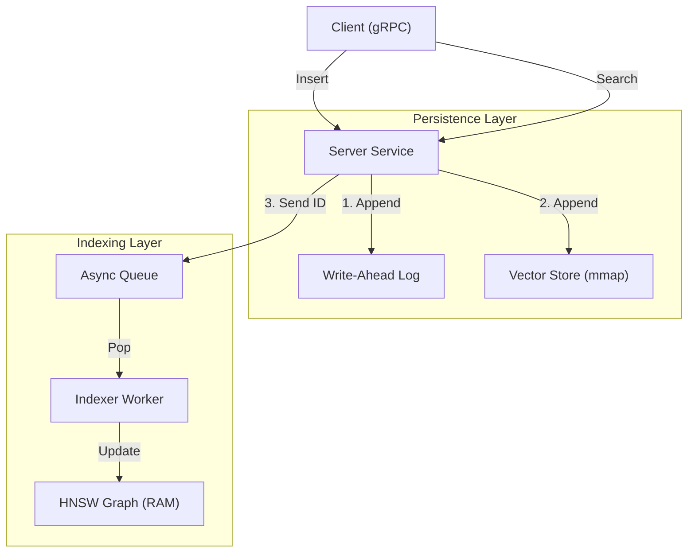

# [H] HyperspaceDB

<div align="center">

[](https://github.com/yarlabs/hyperspacedb/actions)
[](https://www.gnu.org/licenses/agpl-3.0)
[](https://www.rust-lang.org/)
[](COMMERCIAL_LICENSE.md)

**The Fastest Hyperbolic Vector Database written in Rust.**

[Features](#-key-features) • [Architecture](#-architecture) • [Quick Start](#-quick-start) • [Benchmarks](#-performance-benchmarks) • [SDKs](#-sdks) • [License](#-license) • [Contributing](#-contributing) • [Roadmap](#-roadmap) • [DockerHub](https://hub.docker.com/r/glukhota/hyperspace-db)

</div>

---

## 💡 What is HyperspaceDB?

**HyperspaceDB** is a specialized vector database designed for high-performance embedding search in the **Poincaré ball model**. Unlike traditional Euclidean databases, HyperspaceDB is mathematically optimized for hierarchical and taxonomical data, preserving structural relationships with higher precision at lower dimensions.

Built on a **Persistence-First, Index-Second** architecture, it guarantees zero data loss and non-blocking search availability, powered by SIMD intrinsics and memory-mapped storage.

## 🚀 Key Features

<table>
  <tr>
    <td>⚡️ <b>Extreme Performance</b></td>
    <td>Built with <b>Nightly Rust</b> and `std::simd` intrinsics for maximum throughput on AVX2/Neon CPUs.</td>
  </tr>
  <tr>
    <td>📐 <b>Native Hyperbolic HNSW</b></td>
    <td>A custom implementation of Hierarchical Navigable Small Worlds, mathematically tuned for the Poincaré metric (no expensive `acosh` overhead).</td>
  </tr>
  <tr>
    <td>🔒 <b>Secure & Auth</b></td>
    <td>Native API Key security (SHA-256) and Role-based Access Control for production deploy.</td>
  </tr>
  <tr>
    <td>🔎 <b>Advanced Filtering</b></td>
    <td>Complex metadata filtering with `Range` and `Match` operators using Roaring Bitmaps.</td>
  </tr>
  <tr>
    <td>🤝 <b>Distributed HA</b></td>
    <td>Leader-Follower replication with WAL streaming for High Availability and Read Scaling.</td>
  </tr>
  <tr>
    <td>🧠 <b>Hybrid Search</b></td>
    <td>Combine semantic (vector) search with keyword (lexical) search using Reciprocal Rank Fusion (RRF).</td>
  </tr>
  <tr>
    <td>📦 <b>ScalarI8 & Binary</b></td>
    <td>Integrated <b>ScalarI8</b> and <b>Binary (1-bit)</b> quantization reduces memory footprint by up to <b>64x</b> with blazing speed.</td>
  </tr>
  <tr>
    <td>🧵 <b>Async Write Pipeline</b></td>
    <td>Decoupled ingestion with a WAL V2 ensures persistence of data and metadata without blocking reads.</td>
  </tr>
  <tr>
    <td>🖥️ <b>Mission Control TUI</b></td>
    <td>A real-time terminal dashboard (Ratatui) for monitoring QPS, segment growth, and system health.</td>
  </tr>
  <tr>
    <td>🛠️ <b>Runtime Tuning</b></td>
    <td>Dynamically adjust `ef_search` and `ef_construction` parameters via gRPC without restarting the server.</td>
  </tr>
</table>

---

## 🔒 Security

* **API Keys**: Secure endpoints with `HYPERSPACE_API_KEY` environment variable.
* **Header**: Clients must send `x-api-key: <key>`.
* **Zero-Knowledge**: Server stores only SHA-256 hash of the key in memory.

## 🤝 Distributed Replication

HyperspaceDB supports **Leader-Follower** architecture for High Availability.

* **Leader**: Handles Writes & Reads. Streams WAL events to followers.
* **Follower**: Read-Only. Replicates data in real-time.

```bash
# Start Leader
./hyperspace-server --port 50051 --role leader

# Start Follower
./hyperspace-server --port 50052 --role follower --leader http://127.0.0.1:50051
```

## 🧠 Hybrid Search (RRF)

Combine the power of Hyperbolic Embeddings with traditional Keyword Search.

```python
# Search for semantic similarity AND keyword match (e.g. "iphone")
results = client.search(
    vector=[0.1]*8, 
    top_k=5, 
    hybrid_query="iphone", 
    hybrid_alpha=0.3
)
```

## 📉 Binary Quantization (1-bit)

Use `Binary` quantization mode to compress vectors by **32x-64x** (vs f32/f64).
Ideal for large-scale datasets where memory is the bottleneck.

---

## 🛠 Architecture

HyperspaceDB strictly follows a **Command-Query Separation (CQS)** pattern:



1. **Transport**: gRPC/Tonic server accepts requests (Insert/Search).
2. **Persistence**: Data is immediately persisted to **WAL** and segmented **Mmap storage**.
3. **Indexing**: A background worker updates the HNSW graph asynchronously.
4. **Recovery**: Graph snapshots (via `rkyv` zero-copy) ensure near-instant restarts.

👉 *For deep dive, read [ARCHITECTURE.md*](ARCHITECTURE.md)

---

## 💻 System Requirements

HyperspaceDB is designed to run efficiently on commodity hardware, but specific instruction sets are required for hardware acceleration.

### CPU (Critical)

* **Architecture**: x86-64 or ARM64.
* **Instructions**:
* **x86-64**: Must support **AVX2** (Intel Haswell 2013+ or AMD Zen 2017+).
* **ARM64**: Must support **NEON** (Standard on Apple Silicon M1/M2/M3 and AWS Graviton).
* *Note: The database will crash or fail to compile on CPUs without SIMD support.*

### Storage (I/O)

* **Disk Type**: **SSD / NVMe** is highly recommended.
* HyperspaceDB uses `mmap` for random access. Spinning HDDs (mechanical drives) will severely degrade search latency due to seek times.

### Memory (RAM)

* **Minimum**: 512 MB.
* **Recommended**: Enough RAM to cache the "hot" part of your dataset.
* Thanks to **ScalarI8 quantization**, 1 Million vectors (8-dim) take only ~12 MB of disk space. Even large datasets fit easily into RAM.
* If the dataset exceeds RAM, the OS will swap pages to disk (performance will depend on SSD speed).

### Operating System

* **Linux**: Kernel 5.10+ recommended (for efficient memory mapping).
* **macOS**: 12.0+ (fully supported).
* **Windows**: Supported via WSL2 (native Windows build is experimental).

---

## 🏃 Quick Start

### 1. Build and Start Server

Make sure you have `just` and `nightly rust` installed.

```bash
# Build release binary
cargo build --release

# Run server
./target/release/hyperspace-server

```

### 2. Launch Dashboard (TUI)

Open a new terminal to monitor the database:

```bash
./target/release/hyperspace-cli

```

### 3. Use Python SDK

```bash
pip install ./sdks/python

```

```python
from hyperspace import HyperspaceClient, OpenAIEmbedder

# Connect to local instance with built-in Embedder
client = HyperspaceClient(
    embedder=OpenAIEmbedder(api_key="sk-...")
)

# Insert text document (auto-vectorized)
client.insert(id=1, document="HyperspaceDB is fast.", metadata={"tag": "docs"})

# Search with text (auto-vectorized)
results = client.search(query_text="fast database", top_k=5)
print(results)
```

```

## ⚙️ Runtime Configuration

HyperspaceDB v1.1 supports dynamic dimensionality selection via Environment Variables (`.env`).

| Variable | Description | Supported Values | Default |
| :--- | :--- | :--- | :--- |
| `HS_DIMENSION` | Vector dimensions | `1024` (BGE-M3), `1536` (OpenAI), `768` (Bert), `8` (Test) | `1024` |
| `HS_DISTANCE_METRIC` | Distance formula | `poincare` | `poincare` |
| `HS_QUANTIZATION_LEVEL` | Compression level | `scalar` (i8), `binary` (1-bit), `none` (f32) | `scalar` |
| `HS_HNSW_EF_SEARCH` | Search beam width | Integer (10-500) | `10` |
| `HS_HNSW_EF_CONSTRUCT` | Index build quality | Integer (50-500) | `100` |

*Note: The server binary includes optimized kernels for these specific dimensions. To change dimensions, simply update `.env` and restart.*

---


## 📊 Best Practices

HyperspaceDB follows the microservices philosophy: One Index per Instance. To manage multiple datasets, we recommend deploying separate Docker containers or using Metadata Filtering for logical separation within a single index.

### 1. Vector Dimensionality

* **Recommendation**: Choose dimensions matching your embedding model.
* **Support**: Native support for **1024** (BGE-M3), **1536** (OpenAI), **768** (BERT), and **8** (Hyperbolic).
* **Reason**: HyperspaceDB now uses Const Generics to optimize for specific dimensions at compile time.

### 2. Quantization Strategy

* **Mode**: Use `Binary` quantization for maximum memory savings.
* **Trade-off**: `Binary` mode reduces precision but compresses vectors by **32x-64x** compared to floating-point.
* **When to use**: Large-scale datasets where memory is the bottleneck.

### 3. Indexing Parameters

* **`ef_construction`**: Controls index build time vs. search quality. Higher values = better recall but slower indexing.
* **`ef_search`**: Controls search time vs. recall. Higher values = better recall but slower search.
* **Tuning**: Adjust via gRPC without restarting the server.

### 4. Hybrid Search

* **Enable**: Use `hybrid_query` parameter in search requests.
* **Tuning**: Adjust `hybrid_alpha` (0.0 to 1.0) to balance semantic similarity and keyword matching.

---

## 📊 Performance Benchmarks

*Tested on Apple M4 Pro (Emulated), 1M Vectors (8D).*

| Metric | Result | Notes |
| --- | --- | --- |
| **Insert Throughput** | **~15,500 vec/sec** | Sustained rate via Async Write Buffer |
| **Search Latency** | **~0.07 ms** | At 1M vector scale (14,600 QPS) |
| **Degradation** | **< 10%** | Minimal speed loss scaling from 10k to 1M vectors |
| **Storage** | **Segmented mmap** | Automatic scaling beyond RAM limits |

> **The 1 Million Challenge:** HyperspaceDB successfully handles **1,000,000 vectors** with minimal latency degradation, proving the efficiency of our Segmented Storage and Hyperbolic HNSW implementation.

---

## 🐳 Deployment

### Docker

HyperspaceDB is available as a lightweight Docker image.

```bash
# Build
docker build -t hyperspacedb:latest .

# Run
docker run -p 50051:50051 hyperspacedb:latest

```

### Docker Compose

Run the full stack (Server + Client Tool):

```bash
docker-compose up -d

```

## 🐳 How to use this image

### 1. Start a single instance

To start the database and expose the gRPC port (50051):

```bash
docker run -d \
  --name hyperspace \
  -p 50051:50051 \
  glukhota/hyperspace-db:latest

```

### 2. Persisting Data (Critical)

By default, data is stored inside the container. To prevent data loss when the container is removed, you **must** mount a volume to `/data`.

```bash
docker run -d \
  --name hyperspace \
  -p 50051:50051 \
  -v $(pwd)/hs_data:/data \
  glukhota/hyperspace-db:latest

```

---

## 📦 SDKs

Official 1st-party drivers:

| Language | Path | Status |
| --- | --- | --- |
| 🐍 **Python** | `sdks/python` | ✅ Beta |
| 🦀 **Rust** | `crates/hyperspace-sdk` | ✅ Beta |
| 🐹 **Go** | `sdks/go` | 🚧 Planned |
| 🦕 **TypeScript** | `sdks/ts` | 🚧 Planned |

---

## 📄 License

This project is licensed under a dual-license model:

1. **Open Source (AGPLv3)**: For open source projects. Requires you to open-source your modifications. See [LICENSE](https://www.google.com/search?q=LICENSE).
2. **Commercial**: For proprietary/closed-source products. Allows keeping modifications private. See [COMMERCIAL_LICENSE.md](https://www.google.com/search?q=COMMERCIAL_LICENSE.md).

**Copyright © 2026 YARlabs**