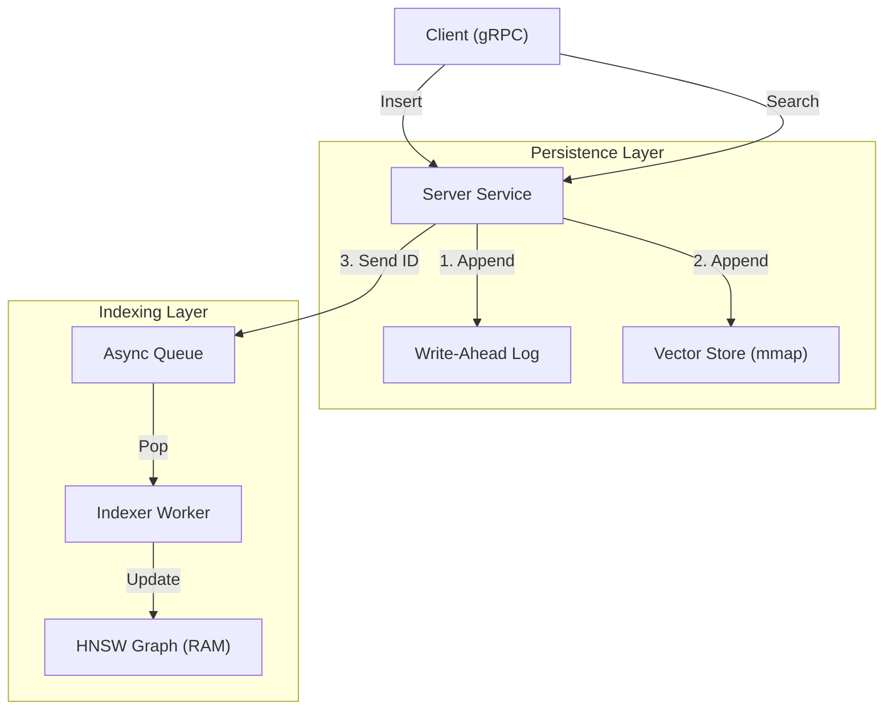

# [H] HyperspaceDB: The Spatial AI Engine

<div align="center">

[](https://github.com/yarlabs/hyperspacedb/actions)
[](https://www.gnu.org/licenses/agpl-3.0)
[](https://www.rust-lang.org/)
[](COMMERCIAL_LICENSE.md)

**v3.0.0** | **The World's First Spatial AI Engine.**

[Why Spatial AI?](#-why-a-spatial-ai-engine) • [Use Cases](#-use-cases) • [Architecture](#-architecture) • [Benchmarks](#-performance-benchmarks) • [SDKs](#-sdks)

</div>

---

## 🌌 What is HyperspaceDB?

Traditional vector databases were built to search static PDF files for chatbots. **HyperspaceDB is built for Autonomous Agents, Robotics, and Continuous Learning.**

It is the world's first **Spatial AI Engine** — a mathematically advanced memory infrastructure that models information exactly how the physical world and human cognition are structured: as hierarchical, spatial, and dynamic graphs.

By combining **Hyperbolic Geometry (Poincaré & Lorentz models)**, **Lock-Free Concurrency**, and an **Edge-to-Cloud Serverless architecture**, HyperspaceDB allows machines to navigate massive semantic spaces in microseconds, using a fraction of the RAM required by traditional databases.

## 🧠 Why a Spatial AI Engine? (Beyond RAG)

AI is moving from text-in/text-out to autonomous action. Agents need *episodic memory* and *spatial reasoning*. HyperspaceDB provides the primitives to build it:

* **Fractal Knowledge Graphs:** Euclidean vectors fail at hierarchies. Our native Hyperbolic engine compresses massive trees (like codebases or taxonomies) into 64-dimensional spaces, reducing RAM usage by 50x without losing semantic context.
* **Continuous Reconsolidation:** AI agents need to "sleep" and organize memories. With our **Fast Upsert Path**, **CDC Event Streams**, and built-in **Riemannian Math SDK** (Fréchet mean, parallel transport), your agents can continuously shift and prune vectors dynamically.
* **Edge-to-Cloud & Offline-First:** Drones and humanoid robots can't wait for cloud latency. HyperspaceDB runs directly on Edge hardware, using a **Merkle Tree Delta Sync** protocol (`SyncHandshake`, `SyncPull`, `SyncPush`) to asynchronously handshake and sync episodic memory chunks with the Cloud when the network is available.
* **Serverless at Billion-Scale:** HyperspaceDB dynamically unloads idle logic to disk/S3, enabling you to host millions of vectors across thousands of tenants on a single commodity server, acting as the "Neon of Vector Search."

---

## 🚀 Core Pillars (v3.0 LTS)

<table>
  <tr>
    <td>⚙️ <b>Reflex-Level Speed</b></td>
    <td>Built on Nightly Rust. Our <b>ArcSwap Lock-Free architecture</b> and <code>f32</code> SIMD intrinsics deliver up to <b>12,000 Search QPS</b> and <b>60,000 Ingest QPS</b> on a single node.</td>
  </tr>
  <tr>
    <td>🧭 <b>Global Meta-Router</b></td>
    <td>Implements pure <b>Compute/Storage Separation</b>. The RAM-resident <code>MetaRouter</code> queries thousands of underlying HNSW fragments (chunks) in microseconds, pulling heavy data from NVMe/S3 via Paged Loading on the fly.</td>
  </tr>
  <tr>
    <td>🎓 <b>Cognitive Math Engine</b></td>
    <td>First-class HNSW support for Euclidean (L2/Cosine), <b>Poincaré Ball</b>, and <b>Lorentz Hyperboloid</b> metrics. Execute spatial K-Means, Fréchet Mean, and Parallel Transport directly in the Native SDK.</td>
  </tr>
  <tr>
    <td>📡 <b>Agentic Workflows</b></td>
    <td>Built-in Change Data Capture (CDC) via <code>subscribe_to_events</code>. Trigger L-System logic, graph updates, or secondary models the millisecond a vector is stored.</td>
  </tr>
  <tr>
    <td>🧹 <b>Metadata-Driven Pruning</b></td>
    <td>Agents must forget to stay efficient. Use typed numeric Range Filters (<code>energy < 0.1</code>) inside a Hot Vacuum to automatically prune obsolete memories.</td>
  </tr>
  <tr>
    <td>📦 <b>LSM-Tree Storage</b></td>
    <td>Optimized for high-concurrency writes. Hot <b>MemTables</b> continuously flush into immutable <b>Fractal Segments</b> (<code>chunk_N.hyp</code>), enabling near-instant RAM reclamation and stable performance at billion-scale.</td>
  </tr>
  <tr>
    <td>☁️ <b>S3 Cloud Tiering</b></td>
    <td>Native <b>S3/MinIO</b> tiered storage integration. Seamlessly offload cold segments mapping Petabytes of vectors linearly without scaling local SSDs. <i>(Unlock via Cargo feature <code>s3-tiering</code> & <code>HS_STORAGE_BACKEND=s3</code>)</i>.</td>
  </tr>
</table>

## 🤖 Target Use Cases

1.  **Robotics & Autonomous Drones:** On-device semantic memory, Hierarchical SLAM, and offline-first edge synchronization.
2.  **Continuous Learning Systems (AGI):** Frameworks doing Riemannian optimization, memory reconsolidation, and Hausdorff-based graph pruning.
3.  **Enterprise Graph AI:** Merging relational logic with semantic proximity for massive multi-scale data analysis (Code ASTs, Medical Taxonomies).
4.  **High-Load RAG & SaaS:** Traditional search, but significantly cheaper to operate due to Serverless Idle Eviction and multi-tenant isolation.

---

## ⚡ 1 Million Vectors Benchmark (v3.0.0 LTS)
 
We pushed **HyperspaceDB v3.0** to the limit with a **1 Million Vector Dataset**.
The results define a new standard for performance and efficiency.

### 🏆 Hyperbolic Efficiency (Poincaré 64d)
When using the native **Hyperbolic (Poincaré)** metric, HyperspaceDB achieves unparalleled throughput by reducing dimensionality (64d) while preserving semantic structure achievable only with 1024d in Euclidean space.

| Metric | Result | vs Euclidean |
| :--- | :--- | :--- |
| **Throughput** | **156,587 QPS** ⚡ | **8.8x Faster** |
| **P99 Latency** | **2.47 ms** | **3.3x Lower** |
| **Disk Usage** | **687 MB** | **13x Smaller** |

### ⚔️ Euclidean Performance (1024d)
Even in standard Euclidean mode, HyperspaceDB outperforms competitors on standard hardware.

| Database       | Total Time (1M vectors) | Speedup Factor |
| :---           | :---                    | :---           |
| **HyperspaceDB** | **56.4s** ⚡             | **1x** |
| Milvus         | 88.7s                   | 1.6x slower    |
| Qdrant         | 629.4s (10m 29s)        | 11.1x slower   |
| Weaviate       | 2036.3s (33m 56s)       | 36.1x slower   |
 
### 📉 Zero Degradation Architecture
While other databases slow down as data grows, HyperspaceDB maintains consistent throughput.
* **Weaviate** degraded from 738 QPS -> 491 QPS (-33%).
* **Milvus** fluctuated between 6k and 11k QPS.
* **HyperspaceDB** held steady at **~156k QPS** (Hyperbolic) and **~17.8k QPS** (Euclidean).

### 💾 50% Less Disk Usage
Store more, pay less. HyperspaceDB's 1-bit quantization and efficient storage engine require half the disk space of Milvus for the exact same dataset.
 
* **HyperspaceDB:** 9.0 GB (Euclidean) / 0.7 GB (Hyperbolic)
* **Milvus:** 18.5 GB
 
> *Benchmark Config: 1M Vectors, 1024 Dimensions (Euclidean) vs 64 Dimensions (Hyperbolic), Batch Size 1000.*

---

## 🔒 Security

* **API Keys**: Secure endpoints with `HYPERSPACE_API_KEY` environment variable.
* **Header**: Clients must send `x-api-key: <key>`.
* **Zero-Knowledge**: Server stores only SHA-256 hash of the key in memory.

## 🤝 Federated Clustering & P2P Swarm (v3.0)
HyperspaceDB implements two distinct clustering architectures designed for both high availability in the Cloud and dynamic Edge-to-Edge discovery for robotics swarms.

### 1. Leader-Follower Replication (Cloud / High Availability)
* **Node Identity**: Each node generates a unique UUID (`node_id`) and maintains a Lamport logical clock.
* **Leader**: Handles Writes (Coordinator). Streams WAL events. Manages Cluster Topology.
* **Follower**: Read-Only replica. Can be promoted to Leader.

### 2. Edge-to-Edge Gossip Swarm (Robotics / Local-First)
Designed for robotic swarms without a central Leader. Uses raw UDP multicasting to form a decentralized, self-healing network.
* **Zero-Dependency**: Built on raw `tokio::net::UdpSocket` (no heavy libp2p dependencies).
* **Heartbeats**: Nodes broadcast state via UDP. Disconnected nodes are automatically evicted after a TTL interval.
* **Auto-Discovery**: Discover peers and instantly initiate a Delta Sync handshake to resolve diverging graphs.
* **Enable**: Set `HS_GOSSIP_PEERS` (e.g. `192.168.1.10:7946`) or `HS_GOSSIP_PORT` to join the swarm.

### Data Synchronization (Edge-to-Cloud Delta Sync)
HyperspaceDB uses a **256-bucket Merkle Tree** for efficient data drift detection, ideal for WASM/Edge targets updating offline:

* **Granular Hashing**: Each collection is partitioned into 256 buckets (by vector ID % 256)
* **XOR Rolling Hash**: Each bucket maintains an incremental hash of its vectors
* **Fast Diffing**: Compare bucket hashes to identify which partition is out of sync
* **Bandwidth Optimization**: Sync only affected buckets instead of full collection

#### WASM Sync Example
When your robot or web client comes back online, initiating a Sync is mathematically minimal:

```javascript
// 1. Handshake: Send local 256 bucket hashes
const { diffBuckets } = await client.syncHandshake(collection, localBuckets);

if (diffBuckets.length > 0) {
    // 2. Pull only the modified/missing buckets from Cloud
    const stream = client.syncPull(collection, diffBuckets);
    stream.on('data', (vectorData) => applyLocal(vectorData));
    
    // 3. Push local offline edits back to Cloud
    client.syncPush(localEditsQueue);
}
```

#### Digest API
```bash
# HTTP
GET /api/collections/{name}/digest

# gRPC
rpc GetDigest(DigestRequest) returns (DigestResponse)
```

Response includes:
- `logical_clock`: Lamport timestamp
- `state_hash`: Root hash (XOR of all buckets)
- `buckets`: Array of 256 bucket hashes
- `count`: Total vector count

### Cluster Topology API
View the logic state of the cluster via HTTP:

```bash
# Get Replication State
curl http://localhost:50050/api/cluster/status

# Get Decentralized Swarm Peers (Gossip)
curl http://localhost:50050/api/swarm/peers
```

```json
{
  "gossip_enabled": true,
  "peer_count": 2,
  "peers": [
    {
       "node_id": "e8...0e",
       "role": "Leader",
       "addr": "192.168.1.20:50050",
       "logical_clock": 42,
       "healthy": true
    }
  ]
}
```

### Starting a Cluster
```bash
# Start Leader
./hyperspace-server --port 50051 --role leader

# Start Follower
./hyperspace-server --port 50052 --role follower --leader http://127.0.0.1:50051
```


## 🕸️ WebAssembly (WASM) Support

HyperspaceDB can run directly in the browser via WebAssembly, enabling **Local-First AI** applications with zero network latency.

* **Zero Latency**: Search runs in-memory on the client.
* **Privacy**: Data never leaves the device.
* **Optimized**: Uses `RAMVectorStore` backend for browser environments.

👉 **[Read the WASM Documentation](docs/wasm.md)**

## ⚖️ Heterogeneous Tribunal Framework (Tribunal Router)

HyperspaceDB natively supports the confrontational model of LLM routing (Architect vs. Tribunal) directly on the vector graph.

Using the **Cognitive Math SDK** and the **Graph Traversal API**, the SDK calculates a **Geometric Trust Score** for any LLM claim by verifying the logical path length between concepts in the latent hyperbolic space.

If the geodesic distance (hops) between "Claim A" and "Claim B" on the graph is too large (or disconnected), the Trust Score drops to `0.0` (Hallucination).

```python
from hyperspace.agents import TribunalContext

tribunal = TribunalContext(client, collection_name="knowledge_graph")

# Evaluates structural graph distance between concepts. 
# 1.0 = Truth (Identical), 0.0 = Hallucination (Disconnected)
score = tribunal.evaluate_claim(concept_a_id=12, concept_b_id=45)
```

## 🧠 Hybrid Search (RRF)

Combine the power of Hyperbolic Embeddings with traditional Keyword Search.

```python
# Search for semantic similarity AND keyword match (e.g. "iphone")
results = client.search(
    vector=[0.1]*8, 
    top_k=5, 
    hybrid_query="iphone", 
    hybrid_alpha=0.3
)
```

## 📉 Binary Quantization (1-bit)

Use `Binary` quantization mode to compress vectors by **32x-64x** (vs f32/f64).
Ideal for large-scale datasets where memory is the bottleneck.

---

## 🛠 Architecture

HyperspaceDB strictly follows a **Command-Query Separation (CQS)** pattern:


```mermaid
graph TD
    Client["Client (gRPC)"] -->|Insert| S["Server Service"]
    Client -->|Search| S
    
    subgraph Persistence_Layer ["Persistence Layer"]
        S -->|"1. Append"| WAL["Write-Ahead Log"]
        S -->|"2. Append"| VS["Vector Store (mmap)"]
    end
    
    subgraph Indexing_Layer ["Indexing Layer"]
        S -->|"3. Send ID"| Q["Async Queue"]
        Q -->|Pop| W["Indexer Worker"]
        W -->|Update| HNSW["HNSW Graph (RAM)"]
    end
```

1. **Transport**: gRPC/Tonic server accepts requests (Insert/Search).
2. **Persistence**: Data is immediately persisted to **WAL** and segmented **Mmap storage**.
3. **Indexing**: A background worker updates the HNSW graph asynchronously.
4. **Recovery**: Graph snapshots (via `rkyv` zero-copy) ensure near-instant restarts.

👉 *For deep dive, read [ARCHITECTURE.md*](ARCHITECTURE.md)

---
 
 ## 🛠 Operations & Maintenance
 
 ### Queue Monitoring
 Check ingestion backlog via API or collections stats:
 ```json
 {
   "count": 150000,
   "indexing_queue": 45  // Items pending index insertion
 }
 ```
 
 ### Rebuild Index (Defragmentation)
 Trigger a graph rebuild to optimize layout and remove deleted nodes:
 ```bash
 curl -X POST http://localhost:50050/api/collections/my_col/rebuild
 ```
 
 ### Memory Management (Jemalloc)
 HyperspaceDB uses **Jemalloc** for efficient memory allocation. You can tune its behavior via the `MALLOC_CONF` environment variable:

 * **Low RAM (Aggressive Release)**: `MALLOC_CONF=background_thread:true,dirty_decay_ms:0,muzzy_decay_ms:0` - Releases unused memory immediately to OS. Increases CPU usage slightly.
 * **Balanced (Default)**: `MALLOC_CONF=background_thread:true,dirty_decay_ms:5000,muzzy_decay_ms:5000` - Keeps some memory for reuse, balanced performance.

 To create a manual memory vacuum request (e.g., after large deletions):
 ```bash
 curl -X POST http://localhost:50050/api/admin/vacuum
 ```
 
 ---

## 💻 System Requirements

HyperspaceDB is designed to run efficiently on commodity hardware, but specific instruction sets are required for hardware acceleration.

### CPU (Critical)

* **Architecture**: x86-64 or ARM64.
* **Instructions**:
* **x86-64**: Must support **AVX2** (Intel Haswell 2013+ or AMD Zen 2017+).
* **ARM64**: Must support **NEON** (Standard on Apple Silicon M1/M2/M3 and AWS Graviton).
* *Note: The database will crash or fail to compile on CPUs without SIMD support.*

### Storage (I/O)

* **Disk Type**: **SSD / NVMe** is highly recommended.
* HyperspaceDB uses `mmap` for random access. Spinning HDDs (mechanical drives) will severely degrade search latency due to seek times.

### Memory (RAM)

* **Minimum**: 512 MB.
* **Recommended**: Enough RAM to cache the "hot" part of your dataset.
* Thanks to **ScalarI8 quantization**, 1 Million vectors (8-dim) take only ~12 MB of disk space. Even large datasets fit easily into RAM.
* If the dataset exceeds RAM, the OS will swap pages to disk (performance will depend on SSD speed).

### Operating System

* **Linux**: Kernel 5.10+ recommended (for efficient memory mapping).
* **macOS**: 12.0+ (fully supported).
* **Windows**: Supported via WSL2 (native Windows build is experimental).

---

## 🏃 Quick Start

### 1. Build and Start Server

Make sure you have `just` and `nightly rust` installed.

```bash
# Build release binary
cargo build --release

# Run server (Default HTTP port: 50050)
./target/release/hyperspace-server

# Or with custom ports
./target/release/hyperspace-server --port 50051 --http-port 50050
```

### 2. Access Web Dashboard

The built-in **React Dashboard** provides real-time monitoring and management:

```
http://localhost:50050
```

**Dashboard Features:**
- 📊 **System Overview**: Real-time metrics (RAM, CPU, vector count)
- 🗂️ **Collections Manager**: Create, delete, and inspect collections
- �️ **Cluster Nodes**: Visualize node topology and replication status
- �🔍 **Data Explorer**: View recent vectors and test search queries
- ⚙️ **Settings**: Integration snippets (Python, cURL) and live logs
- 📈 **Graph Explorer**: (Coming in v1.4) Visualize HNSW graph structure

**Authentication:**
If `HYPERSPACE_API_KEY` is set, you'll be prompted to enter it on first visit. The key is stored in `localStorage` for subsequent sessions.

**Build Dashboard from Source:**
```bash
cd dashboard
npm install
npm run build
# Assets are embedded in Rust binary via rust-embed
```


### 3. Launch TUI Monitor

Open a new terminal to monitor the database:

```bash
./target/release/hyperspace-cli

```

### 3. Use Python SDK

```bash
pip install hyperspacedb==3.0.0
```

```python
from hyperspace import HyperspaceClient

# Connect to local instance
client = HyperspaceClient()

# Create a collection with proper Cognitive Metrics
client.create_collection(name="world_model", dimension=64, metric="poincare")

# Insert text document (you can provide your own embeddings)
client.insert(id=1, collection="world_model", document="Hyperspace is autonomous.")

# Search 
results = client.search(query_text="autonomous engine", top_k=5)
print(results)
```

## 🏘️ Collections Management

HyperspaceDB v1.1+ supports **Multi-Tenancy** via Collections. Each collection is an independent vector index with its own dimension and metric.

### Via Web Dashboard

Access the dashboard at `http://localhost:50050`:

1. **Create Collection**: Enter name, select dimension (8D, 768D, 1024D, 1536D), click Create
2. **View Collections**: See all active collections with their stats
3. **Delete Collection**: Remove collections you no longer need

### Via gRPC/SDK

```python
from hyperspace import HyperspaceClient

client = HyperspaceClient()

# Create a new collection
client.create_collection(name="my_vectors", dimension=1536, metric="poincare")

# Insert into specific collection
client.insert(id=1, document="...", collection="my_vectors")

# Search in specific collection
results = client.search(query_text="...", collection="my_vectors", top_k=5)

# List all collections
collections = client.list_collections()

# Delete a collection
client.delete_collection("my_vectors")
```

**Note**: If no collection is specified, operations default to the `"default"` collection.

## 🏙️ SaaS & Multi-Tenancy (v2.0)

HyperspaceDB is built for SaaS. Isolate thousands of users on a single node.

### 1. User Isolation
Data is logically separated by `user_id`. Each user sees only their own collections.

**How to use:**
Pass the `x-hyperspace-user-id` header in your requests.

```bash
curl -H "x-hyperspace-user-id: tenant_123" http://localhost:50050/api/collections
```

### 2. Billing API
Admins can query usage statistics for all tenants:

```bash
curl -H "x-hyperspace-user-id: admin" http://localhost:50050/api/admin/usage
```

## ⚙️ Configuration & Presets

HyperspaceDB v1.2 introduces flexible configuration presets to support both **Scientific** (Hyperbolic) and **Classic** (Euclidean) use cases.

Configure these via `.env` file or environment variables:

| Variable | Description | Supported Values | Default |
| :--- | :--- | :--- | :--- |
| `HS_DIMENSION` | Vector dimensions | `16`, `32`, `64`, `128` (Hyperbolic) <br> `1024` (BGE), `1536` (OpenAI), `2048` (Voyage) | `1024` |
| `HS_METRIC`    | Distance formula | `poincare` (Hyperbolic) <br> `cosine` (Cosine Similarity) <br> `l2`, `euclidean` (Squared L2) | `cosine` |
| `HS_QUANTIZATION_LEVEL` | Compression | `scalar` (i8), `binary` (1-bit), `none` (f64) | `none` |

### 🎯 Supported Presets

**1. Classic RAG (Default)**
Optimized for standard embeddings from OpenAI, Cohere, Voyage, etc.
* **Metric**: `cosine` (Cosine Similarity) - recommended for OpenAI/BGE embeddings
* **Dimensions**: `1024`, `1536`, `2048`
* **Note**: `cosine` mode automatically normalizes vectors on insert/search (with zero-copy fast path for already normalized vectors) and uses HNSW-friendly squared L2 ranking internally. For magnitude-sensitive workloads, use `l2` with `HS_QUANTIZATION_LEVEL=none`.

**2. Scientific / Hyperbolic**
Optimized for hierarchical data, graph embeddings, and low-dimensional efficiency.
* **Metric**: `poincare`
* **Dimensions**: `16`, `32`, `64`, `128` (Common: 64)
* **Requirement**: Input vectors must strictly satisfy `||x|| < 1.0` (Poincaré ball constraint). Server will reject invalid vectors.

---


## 📊 Best Practices

HyperspaceDB follows the microservices philosophy: One Index per Instance. To manage multiple datasets, we recommend deploying separate Docker containers or using Metadata Filtering for logical separation within a single index.

### 1. Vector Dimensionality

* **Recommendation**: Choose dimensions matching your embedding model.
* **Support**: Native support for **1024** (BGE-M3), **1536** (OpenAI), **768** (BERT), and **8** (Hyperbolic).
* **Reason**: HyperspaceDB now uses Const Generics to optimize for specific dimensions at compile time.

### 2. Quantization Strategy

* **Mode**: Use `Binary` quantization for maximum memory savings.
* **Trade-off**: `Binary` mode reduces precision but compresses vectors by **32x-64x** compared to floating-point.
* **When to use**: Large-scale datasets where memory is the bottleneck.

### 3. Indexing Parameters

* **`ef_construction`**: Controls index build time vs. search quality. Higher values = better recall but slower indexing.
* **`ef_search`**: Controls search time vs. recall. Higher values = better recall but slower search.
* **Tuning**: Adjust via gRPC without restarting the server.

### 4. Hybrid Search

* **Enable**: Use `hybrid_query` parameter in search requests.
* **Tuning**: Adjust `hybrid_alpha` (0.0 to 1.0) to balance semantic similarity and keyword matching.

---

## ⚡ Performance Benchmarks (v2.0)

We tested **HyperspaceDB v2.0** against the industry leaders (Milvus, Qdrant, Weaviate) on a standard 1 Million Vector Dataset (1024 dimensions, Euclidean/Cosine metric).

The results demonstrate HyperspaceDB's **Lock-Free Architecture** advantage: it maintains maximum throughput even under extreme concurrency (1000 threads), while others hit bottlenecks.

### 🏆 Search Performance (QPS)
*High Concurrency (1000 Clients)*

| Database | Queries Per Second (QPS) | Relative Speed |
| :--- | :--- | :--- |
| **HyperspaceDB** | **11,964** 🚀 | **1.0x (Baseline)** |
| Milvus | 3,798 | 3.1x Slower |
| Qdrant | 3,547 | 3.3x Slower |
| Weaviate | 836 | 14.3x Slower |

### 📥 Ingestion Performance (QPS)
*Bulk Insert (Batch Size 1000)*

| Database | Inserts Per Second (QPS) | Relative Speed |
| :--- | :--- | :--- |
| **HyperspaceDB** | **~60,000** ⚡ | **1.0x (Baseline)** |
| Milvus | ~28,000 | 2.1x Slower |
| Qdrant | ~2,100 | 28x Slower |


### 📉 Why is it so fast?
1.  **Lock-Free Reads**: We replaced standard locks with `ArcSwap` and Atomic operations. Readers never block readers.
2.  **SIMD f32**: We utilize AVX2/AVX-512 intrinsics for distance calculations, processing 8-16 vectors per CPU cycle.
3.  **Zero-Copy Persistence**: Our WAL and Memory-Mapped storage ensure data is persisted without serialization overhead.

> *Benchmark Config: 1M Vectors, 1024 Dimensions, M=48, EF=200. Hardware: MacMini M4Pro 64GB RAM.*

---

## 🐳 Deployment

### Docker

HyperspaceDB is available as a lightweight Docker image.

```bash
# Build
docker build -t hyperspacedb:latest .

# Run
docker run -p 50051:50051 -p 50050:50050 hyperspacedb:latest
```

### Docker Compose

Run the full stack (Server + Client Tool):

```bash
docker-compose up -d
```

## 🐳 How to use this image

### 1. Start a single instance

To start the database and expose both gRPC (50051) and Dashboard (50050) ports:

```bash
docker run -d \
  --name hyperspace \
  -p 50051:50051 \
  -p 50050:50050 \
  glukhota/hyperspace-db:latest
```

Access the dashboard at `http://localhost:50050`

### 2. Persisting Data (Critical)

By default, data is stored inside the container. To prevent data loss when the container is removed, you **must** mount a volume to `/app/data`.

```bash
docker run -d \
  --name hyperspace \
  -p 50051:50051 \
  -p 50050:50050 \
  -v $(pwd)/hs_data:/app/data \
  glukhota/hyperspace-db:latest
```

---

## 📦 SDKs (v3.0.0 LTS)

Official 1st-party drivers with full Delta Sync, Cognitive Math, and Event Subscriptions:

| Language | Path | Status |
| --- | --- | --- |
| 🐍 **Python** | [pip install hyperspacedb](https://pypi.org/project/hyperspacedb/) | ✅ v3.0.0 |
| 🦀 **Rust** | [cargo install hyperspacedb](https://crates.io/crates/hyperspace-sdk) | ✅ v3.0.0 |
| 🦕 **TypeScript/JS** | [npm install hyperspace-sdk-ts](https://www.npmjs.com/package/hyperspace-sdk-ts) | ✅ v3.0.0 |
| 🕸️ **WebAssembly** | `crates/hyperspace-wasm` (In-Browser Embedded Engine) | ✅ v3.0.0 |
| 🐹 **Go** | `sdks/go` | ✅ v3.0.0 |
| 🎯 **Dart/Flutter** | `sdks/dart` (Mobile Offline-First) | ✅ v3.0.0 |
| 🤖 **ROS2 / C++** | `sdks/ros2`, `sdks/cpp` (Hardware/Native) | ✅ v3.0.0 |

---

## 📄 License

This project is licensed under a dual-license model:

1. **Open Source (AGPLv3)**: For open source projects. Requires you to open-source your modifications. See [LICENSE](https://www.google.com/search?q=LICENSE).
2. **Commercial**: For proprietary/closed-source products. Allows keeping modifications private. See [COMMERCIAL_LICENSE.md](https://www.google.com/search?q=COMMERCIAL_LICENSE.md).

**Copyright © 2026 YARlabs**