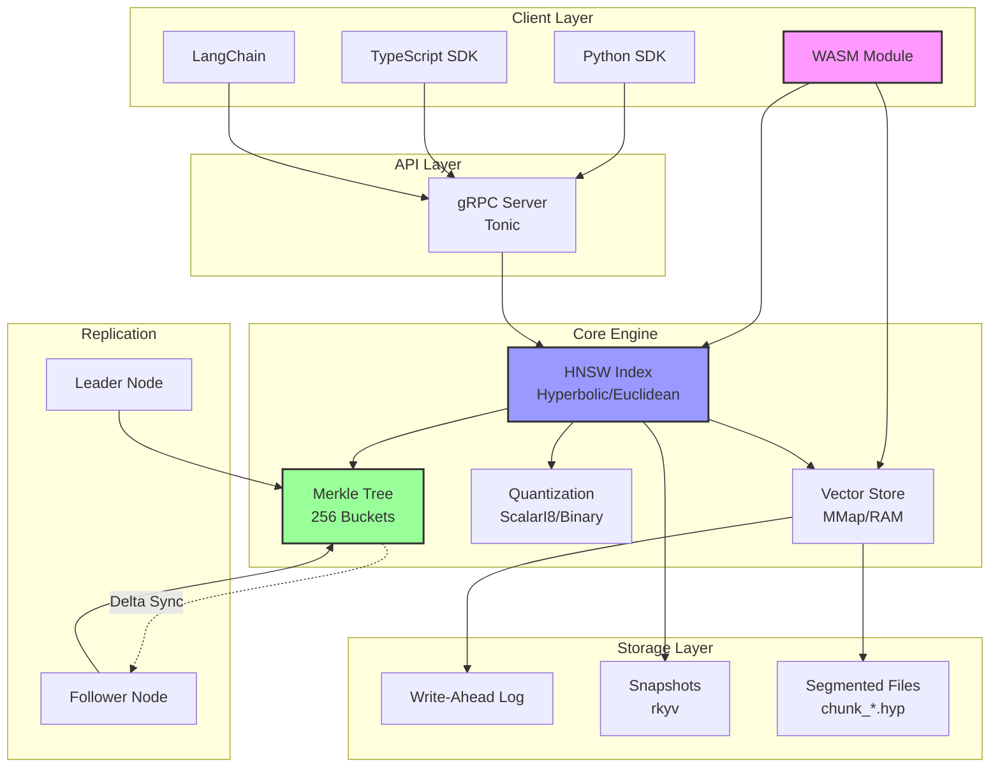
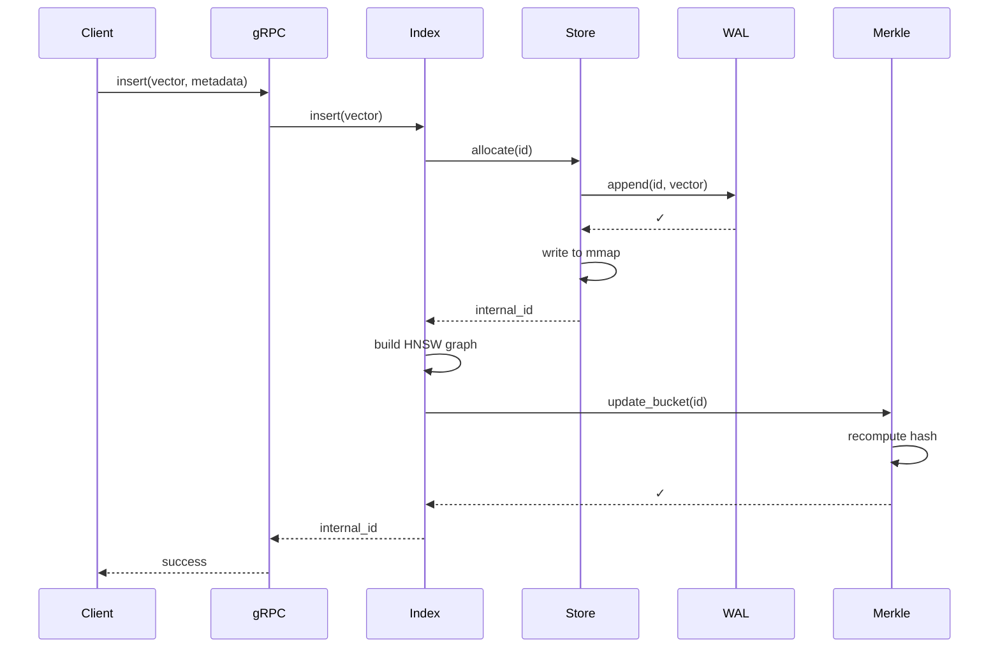
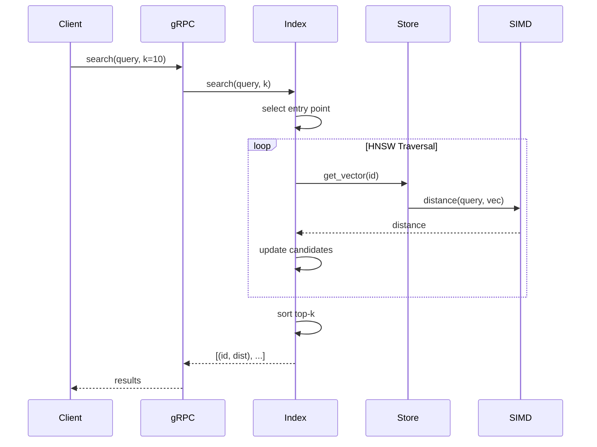
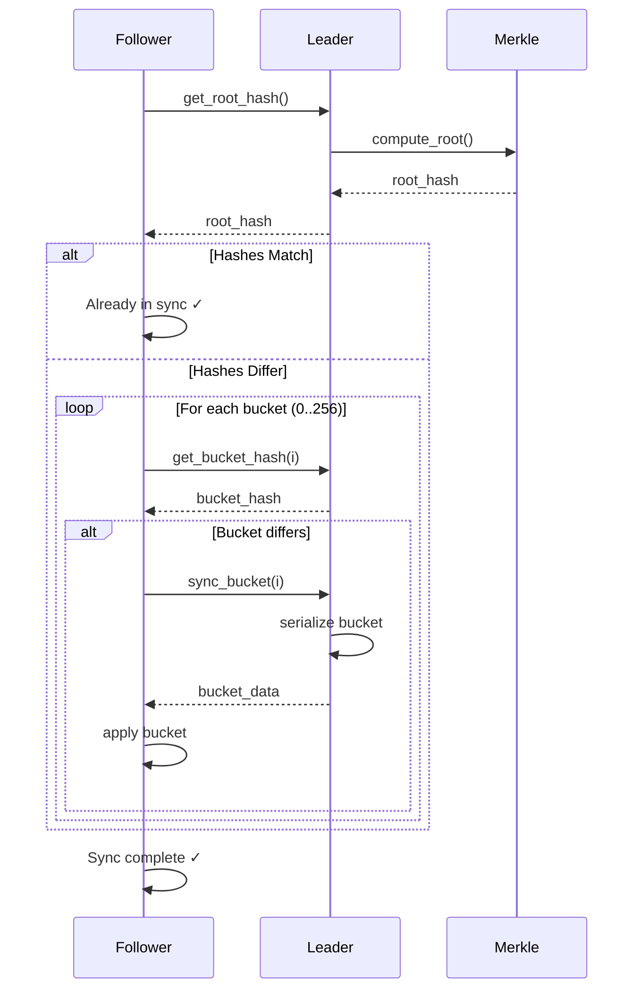
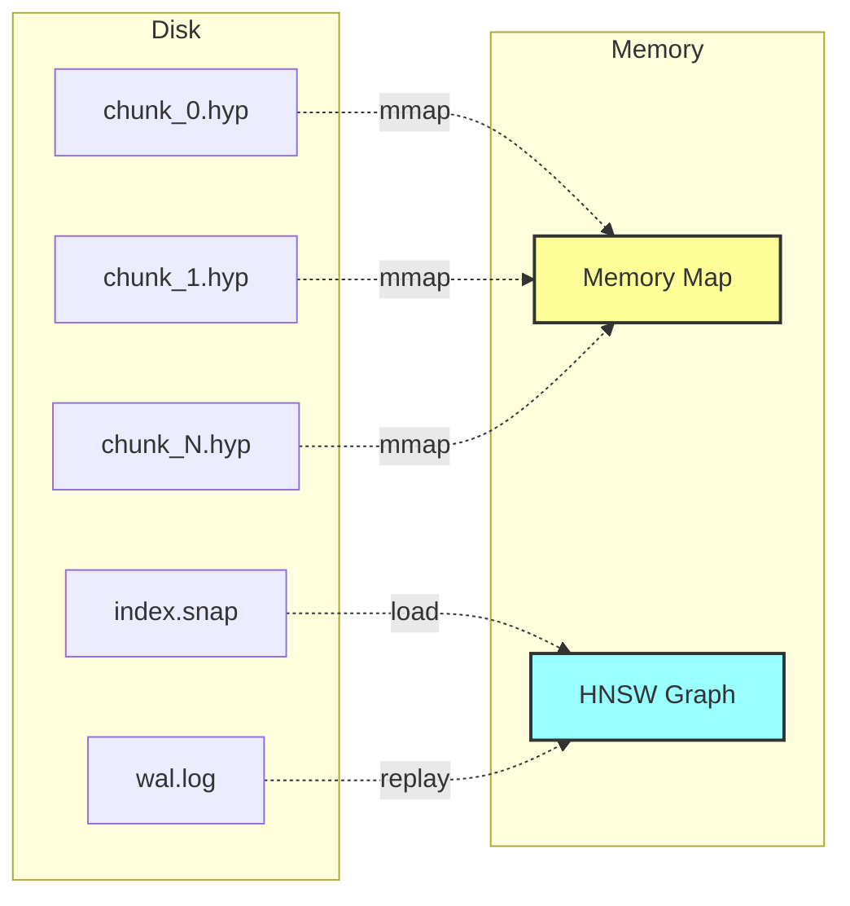
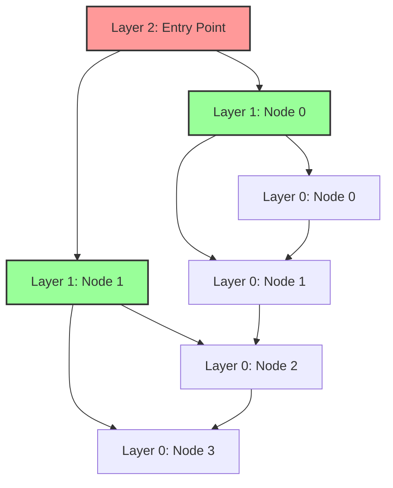
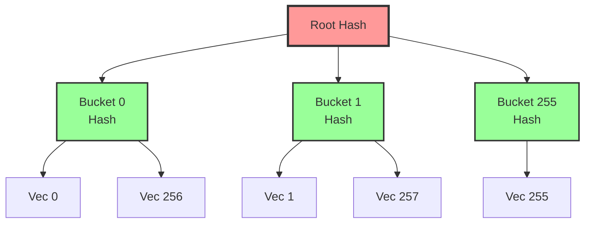
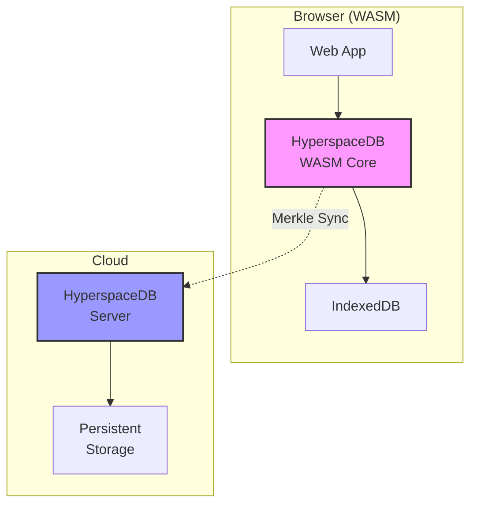
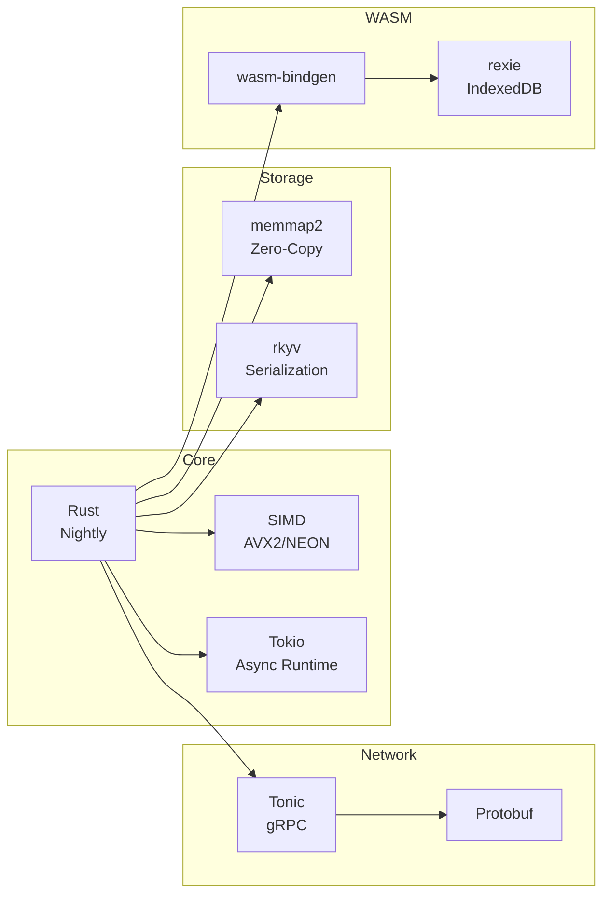

# HyperspaceDB Architecture

## System Overview



## Data Flow: Insert Operation



## Data Flow: Search Operation



## Replication Flow: Merkle Delta Sync



## Storage Layout



## Component Details

### HNSW Index Structure



### Merkle Tree Structure



## Edge-Cloud Federation



## Technology Stack



## Performance Characteristics

| Operation | Latency | Throughput | Notes |
|-----------|---------|------------|-------|
| **Insert** | 110 μs | 9,087 QPS | Async WAL + Background indexing |
| **Search (1M)** | 0.18 ms (p99) | 14,600 QPS | SIMD distance + HNSW |
| **Snapshot** | 500 ms | - | Background task, non-blocking |
| **Merkle Sync** | 11s (1% delta) | - | Bucket-level granularity |
| **WASM Load** | 50 ms | - | IndexedDB deserialization |

## Deployment Topologies

### Single Node
```
┌─────────────────┐
│  HyperspaceDB   │
│   (Standalone)  │
└─────────────────┘
```

### Leader-Follower
```
┌─────────┐    Merkle    ┌───────────┐
│ Leader  │─────Sync────▶│ Follower  │
└─────────┘              └───────────┘
```

### Multi-Region
```
┌─────────┐              ┌─────────┐
│ US-East │◀────Sync────▶│ EU-West │
└─────────┘              └─────────┘
     │                        │
     └────────Sync────────────┘
              │
         ┌─────────┐
         │ AP-South│
         └─────────┘
```

### Edge-Cloud
```
┌──────────┐              ┌──────────┐
│ Browser  │              │  Cloud   │
│  (WASM)  │◀────Sync────▶│  Server  │
└──────────┘              └──────────┘
```
