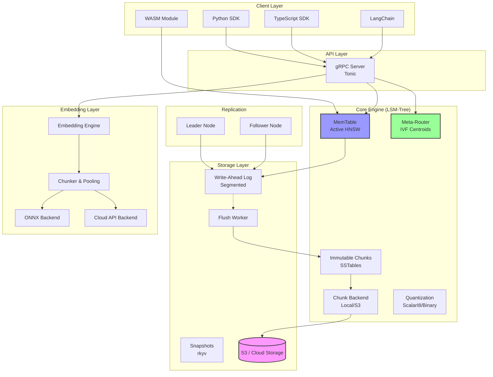
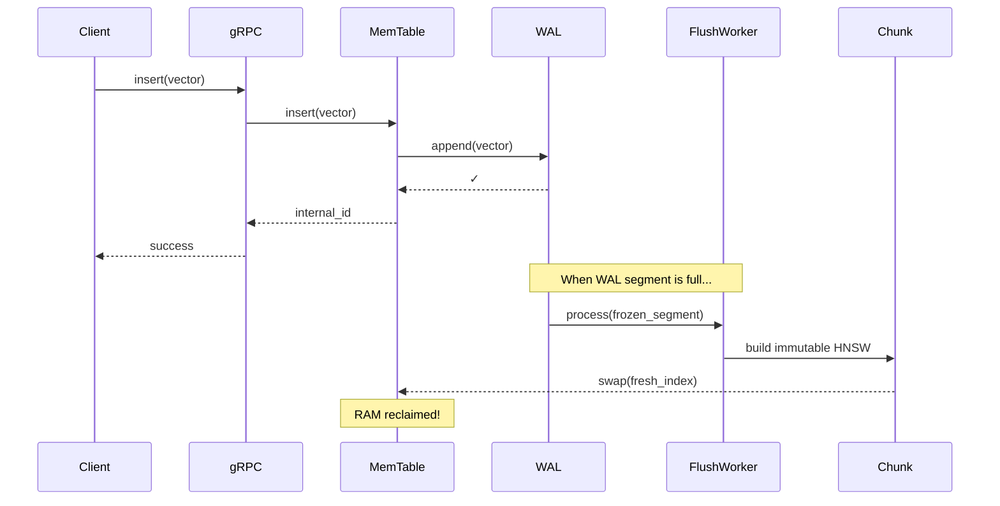
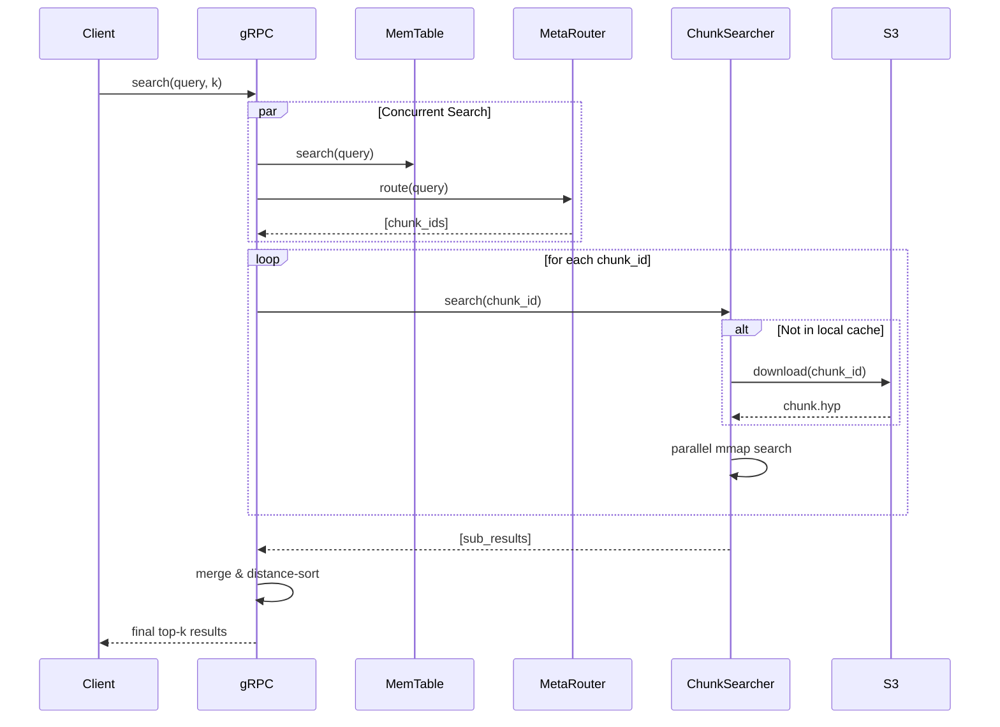
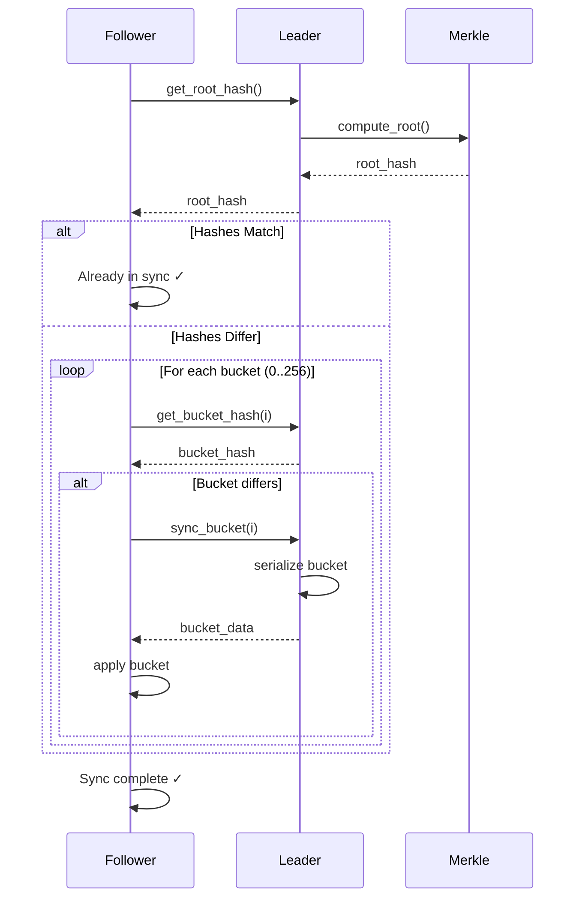
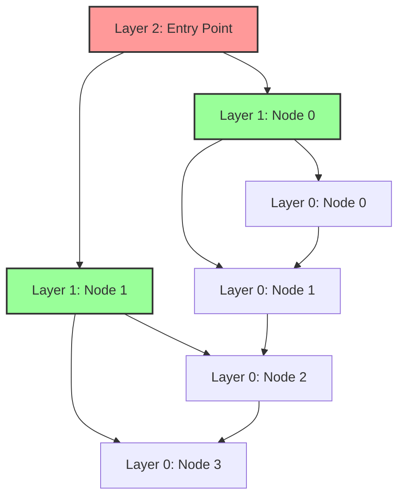
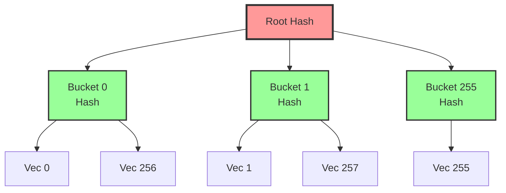
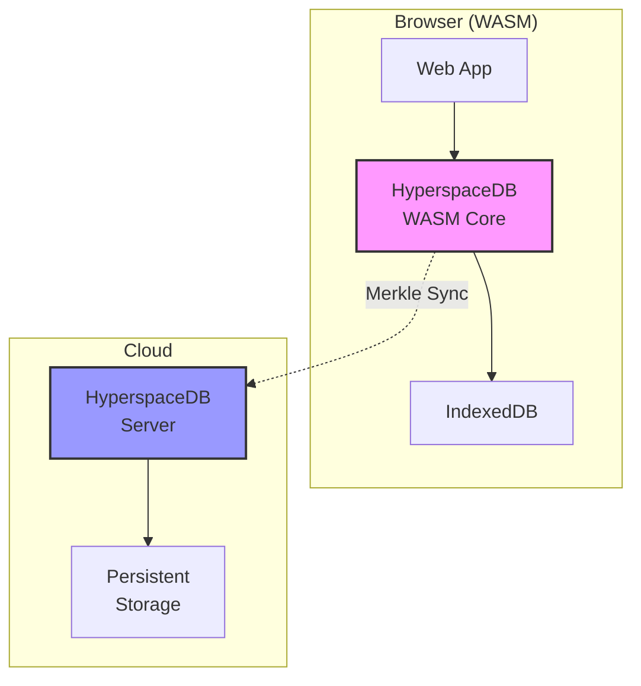
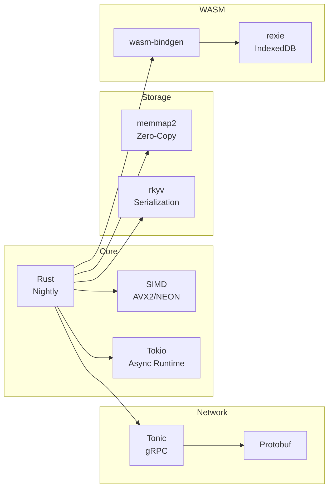

# HyperspaceDB Architecture

## System Overview


```mermaid
graph TB
    subgraph "Client Layer"
        PY[Python SDK]
        TS[TypeScript SDK]
        WASM[WASM Module]
        LC[LangChain]
    end
    
    subgraph "API Layer"
        GRPC[gRPC Server<br/>Tonic]
    end
    
    subgraph "Core Engine (LSM-Tree)"
        MEM[MemTable<br/>Active HNSW]
        CHUNK[Immutable Chunks<br/>SSTables]
        ROUTER[Meta-Router<br/>IVF Centroids]
        BACKEND[Chunk Backend<br/>Local/S3]
        QUANT[Quantization<br/>ScalarI8/Binary]
    end
    
    subgraph "Storage Layer"
        WAL[Write-Ahead Log<br/>Segmented]
        FLUSH[Flush Worker]
        SNAP[Snapshots<br/>rkyv]
        S3[(S3 / Cloud Storage)]
    end

    subgraph "Embedding Layer"
        EMBED[Embedding Engine]
        CHUNKER[Chunker & Pooling]
        BF_ONNX[ONNX Backend]
        BF_API[Cloud API Backend]
    end
    
    subgraph "Replication"
        LEADER[Leader Node]
        FOLLOWER[Follower Node]
    end
    
    PY --> GRPC
    TS --> GRPC
    LC --> GRPC
    WASM --> MEM
    
    GRPC --> MEM
    GRPC --> ROUTER
    GRPC --> EMBED
    EMBED --> CHUNKER
    CHUNKER --> BF_ONNX
    CHUNKER --> BF_API
    MEM --> WAL
    FLUSH --> CHUNK
    WAL -.-> FLUSH
    CHUNK --> BACKEND
    BACKEND --> S3
    
    LEADER --> WAL
    FOLLOWER --> WAL
    
    style S3 fill:#f9f,stroke:#333,stroke-width:2px
    style ROUTER fill:#9f9,stroke:#333,stroke-width:2px
    style MEM fill:#99f,stroke:#333,stroke-width:2px
```

## Data Flow: Insert Operation (LSM-Tree)


```mermaid
sequenceDiagram
    participant Client
    participant gRPC
    participant MemTable
    participant WAL
    participant FlushWorker
    participant Chunk
    
    Client->>gRPC: insert(vector)
    gRPC->>MemTable: insert(vector)
    MemTable->>WAL: append(vector)
    WAL-->>MemTable: ✓
    MemTable-->>gRPC: internal_id
    gRPC-->>Client: success
    
    Note over WAL, FlushWorker: When WAL segment is full...
    WAL->>FlushWorker: process(frozen_segment)
    FlushWorker->>Chunk: build immutable HNSW
    Chunk-->>MemTable: swap(fresh_index)
    Note over MemTable: RAM reclaimed!
```

## Data Flow: Scatter-Gather Search


```mermaid
sequenceDiagram
    participant Client
    participant gRPC
    participant MemTable
    participant MetaRouter
    participant ChunkSearcher
    participant S3
    
    Client->>gRPC: search(query, k)
    par Concurrent Search
        gRPC->>MemTable: search(query)
        gRPC->>MetaRouter: route(query)
        MetaRouter-->>gRPC: [chunk_ids]
    end
    
    loop for each chunk_id
        gRPC->>ChunkSearcher: search(chunk_id)
        alt Not in local cache
            ChunkSearcher->>S3: download(chunk_id)
            S3-->>ChunkSearcher: chunk.hyp
        end
        ChunkSearcher->>ChunkSearcher: parallel mmap search
    end
    
    ChunkSearcher-->>gRPC: [sub_results]
    gRPC->>gRPC: merge & distance-sort
    gRPC-->>Client: final top-k results
```

## Replication Flow: Merkle Delta Sync


```mermaid
sequenceDiagram
    participant Follower
    participant Leader
    participant Merkle
    
    Follower->>Leader: get_root_hash()
    Leader->>Merkle: compute_root()
    Merkle-->>Leader: root_hash
    Leader-->>Follower: root_hash
    
    alt Hashes Match
        Follower->>Follower: Already in sync ✓
    else Hashes Differ
        loop For each bucket (0..256)
            Follower->>Leader: get_bucket_hash(i)
            Leader-->>Follower: bucket_hash
            alt Bucket differs
                Follower->>Leader: sync_bucket(i)
                Leader->>Leader: serialize bucket
                Leader-->>Follower: bucket_data
                Follower->>Follower: apply bucket
            end
        end
    end
    
    Follower->>Follower: Sync complete ✓
```

    subgraph "Local Disk"
        WAL[wal_segment_*.log]
        METAR[meta_router.bin]
        C0[chunk_0.hyp]
        C1[chunk_1.hyp]
        CN[chunk_N.hyp]
    end
    
    subgraph "Memory"
        MEMT[MemTable<br/>HNSW]
        MMAP[Memory Map]
    end

    subgraph "Cloud"
        S3[(S3 Bucket)]
    end
    
    C0 -.mmap.-> MMAP
    C1 -.mmap.-> MMAP
    CN -.mmap.-> MMAP
    WAL -.replay.-> MEMT
    CN --Tiering--> S3
    S3 --Lazy Load--> CN
    
    style MMAP fill:#ff9,stroke:#333,stroke-width:2px
    style MEMT fill:#9ff,stroke:#333,stroke-width:2px
    style S3 fill:#f9f,stroke:#333,stroke-width:2px
```

## Write-Ahead Log (WAL) v3

The WAL ensures durability by appending operations to a log file.
Format: `[Magic: u8][Length: u32][CRC32: u32][OpCode: u8][Data...]`.

- **Integrity**: Each entry is checksummed with CRC32.
- **Recovery**: On startup, the WAL is replayed. Corrupted entries at the tail are strictly truncated to the last valid entry.
- **Durability Modes**:
    1. **Strict**: Calls `fsync` after every write. Max safety.
    2. **Batch**: Calls `fsync` in a background thread every N ms. Good compromise.
    3. **Async**: Relies on OS page cache. Max speed.

## Component Details

### HNSW Index Structure


```mermaid
graph TD
    L2_0[Layer 2: Entry Point]
    L1_0[Layer 1: Node 0]
    L1_1[Layer 1: Node 1]
    L0_0[Layer 0: Node 0]
    L0_1[Layer 0: Node 1]
    L0_2[Layer 0: Node 2]
    L0_3[Layer 0: Node 3]
    
    L2_0 --> L1_0
    L2_0 --> L1_1
    L1_0 --> L0_0
    L1_0 --> L0_1
    L1_1 --> L0_2
    L1_1 --> L0_3
    L0_0 --> L0_1
    L0_1 --> L0_2
    L0_2 --> L0_3
    
    style L2_0 fill:#f99,stroke:#333,stroke-width:2px
    style L1_0 fill:#9f9,stroke:#333,stroke-width:2px
    style L1_1 fill:#9f9,stroke:#333,stroke-width:2px
```

### Merkle Tree Structure


```mermaid
graph TD
    ROOT[Root Hash]
    B0[Bucket 0<br/>Hash]
    B1[Bucket 1<br/>Hash]
    B255[Bucket 255<br/>Hash]
    
    V0_0[Vec 0]
    V0_1[Vec 256]
    V1_0[Vec 1]
    V1_1[Vec 257]
    V255_0[Vec 255]
    
    ROOT --> B0
    ROOT --> B1
    ROOT --> B255
    
    B0 --> V0_0
    B0 --> V0_1
    B1 --> V1_0
    B1 --> V1_1
    B255 --> V255_0
    
    style ROOT fill:#f99,stroke:#333,stroke-width:3px
    style B0 fill:#9f9,stroke:#333,stroke-width:2px
    style B1 fill:#9f9,stroke:#333,stroke-width:2px
    style B255 fill:#9f9,stroke:#333,stroke-width:2px
```

## Edge-Cloud Federation & P2P Swarms

HyperspaceDB supports both hierarchical Cloud boundaries and decentralized Edge networks:

### 1. WASM-Cloud Hybrid Sync

```mermaid
graph TB
    subgraph "Browser (WASM)"
        WASM_APP[Web App]
        WASM_DB[HyperspaceDB<br/>WASM Core]
        IDB[IndexedDB]
    end
    
    subgraph "Cloud"
        SERVER[HyperspaceDB<br/>Server]
        DISK[Persistent<br/>Storage]
    end
    
    WASM_APP --> WASM_DB
    WASM_DB --> IDB
    WASM_DB -.Merkle Sync.-> SERVER
    SERVER --> DISK
    
    style WASM_DB fill:#f9f,stroke:#333,stroke-width:2px
    style SERVER fill:#99f,stroke:#333,stroke-width:2px
```

### 2. Edge-to-Edge Gossip Swarms
For decentralized robotics and AGI systems where no Leader node exists:
* **UDP Heartbeats**: Nodes broadcast a `GossipMessage::Heartbeat` (containing their Logical Clock and partition hashes) every `HEARTBEAT_INTERVAL`.
* **Zero-Dependency**: Does not require Heavy DHT or `libp2p` layers, runs on raw UDP (`tokio::net::UdpSocket`).
* **Self-Healing Topology**: If node $A$ fails, peers notice the lack of UDP packets within `PEER_TTL` and evict it from the swarm memory. When it connects again, `Merkle Sync` auto-resolves missing data.

## ⚖️ Cognitive Math & Tribunal Router

HyperspaceDB natively supports the confrontational model of LLM routing via the **Heterogeneous Tribunal Framework**. 
Using the **Graph Traversal API** integrated with hyperbolic geometry functions, a "Tribunal Agent" can verify the geometrical proximity of two concepts (e.g., node A vs node B). 
If a generated LLM response (concept B) has an extremely long geodesic path from the context (concept A) or is completely disconnected, the system automatically flags the claim as a hallucination, assigning it a Geometric Trust Score ~ 0.0.

In addition to this, HyperspaceDB introduces **Memory Reconsolidation (AI Sleep Mode)** logic. Using Riemannian Gradient Descent and Flow Matching algorithms natively via `TriggerReconsolidation`, vectors can be algorithmically shifted toward semantic attractors while the database is idle, cleaning noisy data distributions structurally.

```python
# The Tribunal validates the claim geometry
score = tribunal.evaluate_claim(concept_a_id=12, concept_b_id=45)
# score = 0.0 (Hallucination) or 1.0 (Identical Concept)
```

## Technology Stack


```mermaid
graph LR
    subgraph "Core"
        RUST[Rust<br/>Nightly]
        SIMD[SIMD<br/>AVX2/NEON]
        TOKIO[Tokio<br/>Async Runtime]
    end
    
    subgraph "Storage"
        MMAP[memmap2<br/>Zero-Copy]
        RKYV[rkyv<br/>Serialization]
    end
    
    subgraph "Network"
        TONIC[Tonic<br/>gRPC]
        PROTO[Protobuf]
    end
    
    subgraph "WASM"
        WBIND[wasm-bindgen]
        REXIE[rexie<br/>IndexedDB]
    end
    
    RUST --> SIMD
    RUST --> TOKIO
    RUST --> MMAP
    RUST --> RKYV
    RUST --> TONIC
    TONIC --> PROTO
    RUST --> WBIND
    WBIND --> REXIE
```

## Performance Characteristics

| Operation | Latency | Throughput | Notes |
|-----------|---------|------------|-------|
| **Insert (Hyp)** | 6.4 μs | 156,587 QPS | Unbounded Channel + mmap |
| **Search (Hyp)** | 2.47 ms (p99) | 165,000 QPS | Poincaré 64d + SIMD |
| **Search (Euc)** | 16.12 ms (p99) | 17,800 QPS | Euclidean 1024d |
| **Startup** | < 1s | - | Immediate (mmap) |
| **Snapshot** | 500 ms | - | Background task, non-blocking |
| **Merkle Sync** | 11s (1% delta) | - | Bucket-level granularity |
| **WASM Load** | 50 ms | - | IndexedDB deserialization |

## Deployment Topologies

### Single Node
```
┌─────────────────┐
│  HyperspaceDB   │
│   (Standalone)  │
└─────────────────┘
```

### Leader-Follower
```
┌─────────┐    Merkle    ┌───────────┐
│ Leader  │─────Sync────▶│ Follower  │
└─────────┘              └───────────┘
```

### Multi-Region
```
┌─────────┐              ┌─────────┐
│ US-East │◀────Sync────▶│ EU-West │
└─────────┘              └─────────┘
     │                        │
     └────────Sync────────────┘
              │
         ┌─────────┐
         │ AP-South│
         └─────────┘
```

### Edge-Cloud
```
┌──────────┐              ┌──────────┐
│ Browser  │              │  Cloud   │
│  (WASM)  │◀────Sync────▶│  Server  │
└──────────┘              └──────────┘
```

## Memory Management & Stability

### Cold Storage Architecture
HyperspaceDB implements a "Cold Storage" mechanism to handle large numbers of collections efficiently:
1.  **Lazy Loading**: Collections are not loaded into RAM at startup. Instead, only metadata is scanned. The actual collection (vector index, storage) is instantiated from disk only upon the first `get()` request.
2.  **Idle Eviction (Reaper)**: A background task runs every 60 seconds to scan for idle collections. Any collection not accessed for a configurable period (default: 1 hour) is automatically unloaded from memory to free up RAM.
3.  **Graceful Shutdown**: When a collection is evicted or deleted, its `Drop` implementation ensures that all associated background tasks (indexing, snapshotting) are immediately aborted, preventing resource leaks and panicked threads.

This architecture allows HyperspaceDB to support thousands of collections while keeping the active memory footprint low, scaling based on actual usage rather than total data.

## 🏙 Multi-Tenancy (v2.0)

HyperspaceDB 2.0 introduces native SaaS multi-tenancy.

- **Logical Isolation**: Collections are prefixed with `user_id` in the storage layer. The `CollectionManager` ensures that requests without the correctly matching `user_id` cannot access or even list other tenants' data.
- **Usage Accounting**: The `UserUsage` report provides per-tenant metrics including total vector count and real disk usage (calculating the size of `mmap` segments and snapshots), facilitating integration with billing systems.

## 🔁 Replication Anti-Entropy (v2.0)

Beyond the Merkle-tree based delta sync, v2.0 implements a **WAL-based Catch-up** mechanism:

1.  **State Reporting**: When a Follower connects via gRPC `Replicate()`, it sends a `ReplicationRequest` containing its `last_logical_clock`.
2.  **Differential Replay**: The leader compares this clock with its own latest state. If the leader has missing entries in its WAL that the follower needs, it streams them sequentially.
3.  **Conflict Resolution**: Lamport clocks ensure that concurrent operations across nodes can be ordered reliably during recovery.

---
*© 2026 YARlabs - Confidential & Proprietary*
